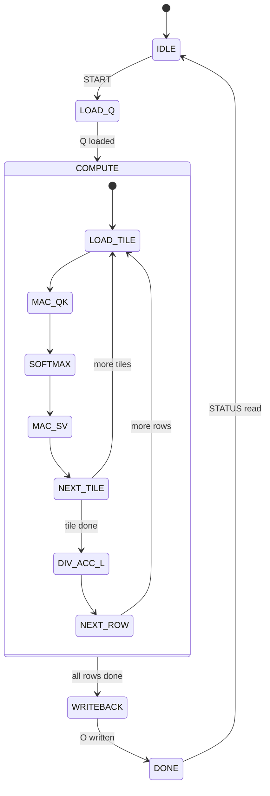
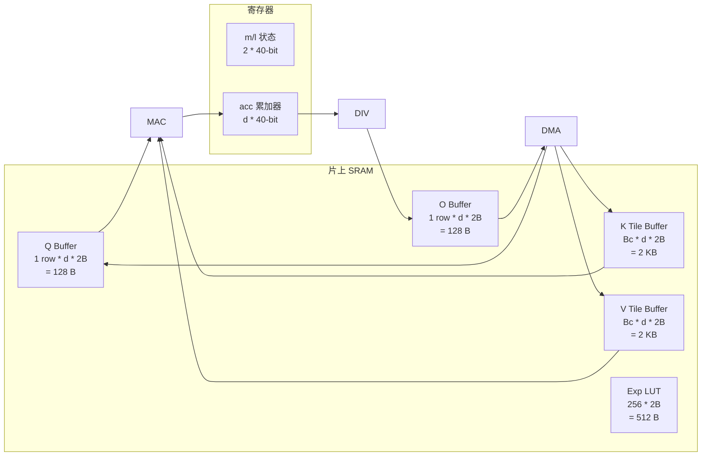

# FlashAttention 加速器 IP — 系统框图

## 1. 顶层框图

```mermaid
graph TB
    subgraph "外部"
        HOST[Host CPU] -->|AXI4-Lite| REGFILE
        MEM[External Memory] <-->|AXI4| DMA
    end

    subgraph "fa_top — FlashAttention 加速器"
        REGFILE[fa_regfile<br/>AXI4-Lite Slave<br/>寄存器文件]
        CTRL[fa_ctrl<br/>主控制器 FSM]
        DMA[fa_dma<br/>AXI4 Master DMA]
        BUFMGR[fa_buffer_mgr<br/>Buffer 管理器]
        MAC[fa_systolic<br/>MAC 阵列 16-wide]
        SOFTMAX[fa_softmax<br/>在线 Softmax]
        DIV[fa_divider<br/>迭代除法器]

        REGFILE -->|配置/状态| CTRL
        CTRL -->|DMA 命令| DMA
        CTRL -->|计算控制| MAC
        CTRL -->|softmax 控制| SOFTMAX
        CTRL -->|除法控制| DIV

        DMA -->|Q/K/V 数据| BUFMGR
        BUFMGR -->|Q row| MAC
        BUFMGR -->|K tile| MAC
        BUFMGR -->|V tile| MAC
        BUFMGR <-->|O 累加| MAC

        MAC -->|score| SOFTMAX
        SOFTMAX -->|exp(score)| MAC
        SOFTMAX -->|m, l 状态| DIV
        MAC -->|acc| DIV
        DIV -->|O[i] = acc/l| BUFMGR

        BUFMGR -->|O 数据| DMA
    end

    style REGFILE fill:#e1f5fe
    style CTRL fill:#fff3e0
    style DMA fill:#e8f5e9
    style BUFMGR fill:#fce4ec
    style MAC fill:#f3e5f5
    style SOFTMAX fill:#fff9c4
    style DIV fill:#efebe9
```

## 2. 数据流图

```mermaid
flowchart LR
    subgraph "输入"
        Q[Q [256,64]<br/>Q8.8]
        K[K [256,64]<br/>Q8.8]
        V[V [256,64]<br/>Q8.8]
    end

    subgraph "处理流水线"
        direction TB
        LOAD_Q["加载 Q[i]"]
        LOAD_KV["加载 K/V tile"]
        DOT1["Q*K^T<br/>MAC"]
        MASK["Causal Mask"]
        SM["Online Softmax<br/>max + exp + sum"]
        DOT2["score*V<br/>MAC"]
        UPDATE["更新 m/l/acc"]
        DIVIDE["acc/l<br/>除法"]
        STORE["存储 O[i]"]
    end

    subgraph "输出"
        O[O [256,64]<br/>Q8.8]
    end

    Q --> LOAD_Q
    K --> LOAD_KV
    V --> LOAD_KV
    LOAD_Q --> DOT1
    LOAD_KV --> DOT1
    DOT1 --> MASK
    MASK --> SM
    SM --> DOT2
    LOAD_KV --> DOT2
    DOT2 --> UPDATE
    UPDATE --> DIVIDE
    DIVIDE --> STORE
    STORE --> O
```

## 3. 状态机概览



## 4. 存储架构


