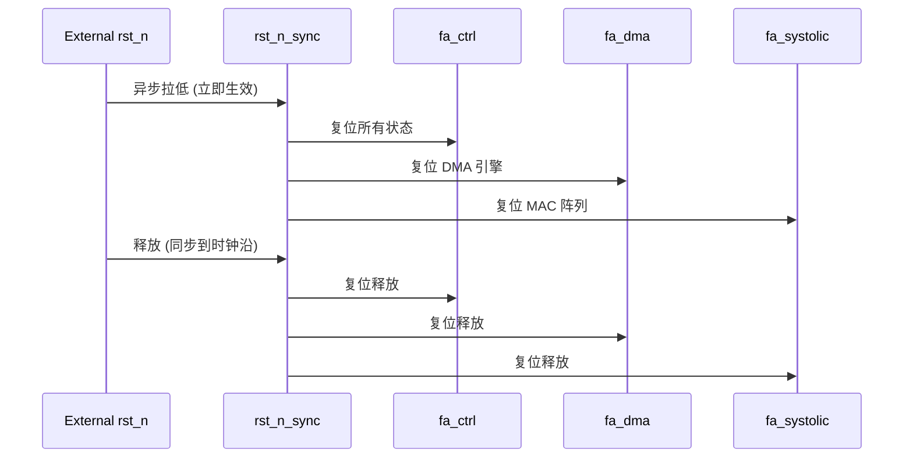

# FlashAttention 加速器 IP — 时钟与复位架构

## 1. 时钟架构

### 1.1 时钟源

| 时钟 | 频率 | 来源 | 说明 |
|------|------|------|------|
| clk | 50 MHz | 外部时钟输入 | 系统主时钟 |

本设计为单时钟域 IP, 无 PLL, 无内部分频。

### 1.2 时钟域划分

| 域名 | 频率 | 覆盖模块 | 说明 |
|------|------|----------|------|
| clk_domain | 50 MHz | 全部模块 | 单一时钟域 |

### 1.3 时钟门控策略

| 级别 | 门控条件 | 实现 |
|------|----------|------|
| 模块级 | IDLE 状态 | fa_ctrl 控制 CG cell |
| 子模块级 | 计算单元空闲 | 各子模块独立门控 |

**Clock Gating Cell**: 使用 ASAP7 库提供的 ICG (Integrated Clock Gate) cell。

### 1.4 时钟约束 (SDC)

```tcl
# 主时钟
create_clock -period 20.0 -name clk [get_ports clk]

# 时钟不确定性
set_clock_uncertainty 0.5 [get_clocks clk]

# 输入延迟
set_input_delay -clock clk -max 5.0 [all_inputs]

# 输出延迟
set_output_delay -clock clk -max 5.0 [all_outputs]
```

---

## 2. 复位架构

### 2.1 复位源

| 复位源 | 类型 | 优先级 | 说明 |
|--------|------|--------|------|
| rst_n | 异步复位 | 最高 | 外部硬件复位, 低有效 |
| SOFT_RESET | 同步复位 | 中 | 软件触发的复位 |

### 2.2 复位策略

**异步置位同步释放 (推荐)**:

```
复位树:
  rst_n (外部异步)
    ├── rst_n_sync (同步释放)
    │   ├── fa_ctrl 复位
    │   ├── fa_dma 复位
    │   ├── fa_systolic 复位
    │   ├── fa_softmax 复位
    │   ├── fa_divider 复位
    │   ├── fa_buffer_mgr 复位
    │   └── fa_regfile 复位
    │
    └── SOFT_RESET (同步)
        └── 同上所有模块
```

### 2.3 复位序列



### 2.4 复位值

| 寄存器 | 复位值 | 说明 |
|--------|--------|------|
| CTRL | 0x0000_0000 | START=0, RESET=0, IRQ_EN=0 |
| STATUS | 0x0000_0000 | BUSY=0, DONE=0, ERROR=0 |
| CFG | 0x0000_0000 | CAUSAL_EN=0 |
| *_BASE | 0x0000_0000 | 地址清零 |
| STRIDE | 0x0000_0080 | 默认 128 |
| NEG_LARGE | 0x0000_8000 | -128.0 (Q8.8) |
| SCALE | 0x0000_0020 | 0.125 (Q8.8) |
| CYCLES | 0x0000_0000 | 计数器清零 |

### 2.5 同步复位实现

```systemverilog
// 异步置位同步释放
always_ff @(posedge clk or negedge rst_n) begin
  if (!rst_n) begin
    rst_n_sync <= 1'b0;
    rst_n_meta <= 1'b0;
  end else begin
    rst_n_meta <= 1'b1;
    rst_n_sync <= rst_n_meta;
  end
end
```

---

## 3. CDC 分析

### 3.1 跨时钟域信号

本设计为单时钟域, 无 CDC 问题。

| 接口 | 信号方向 | CDC 策略 |
|------|----------|----------|
| AXI4-Lite | 外部 → 内部 | 同一域, 无需 CDC |
| AXI4 Master | 内部 → 外部 | 同一域, 无需 CDC |

### 3.2 异步复位处理

| 信号 | 类型 | 处理方式 |
|------|------|----------|
| rst_n | 异步 | 2 级同步器 (rst_n_sync) |

---

## 4. 时序分析要点

### 4.1 关键路径

| 路径 | 延迟估算 | 说明 |
|------|----------|------|
| MAC 阵列 | ~10ns | 16-bit 乘法 + 40-bit 加法 |
| Exp LUT | ~5ns | ROM 读 + 插值 |
| 比较器树 | ~3ns | 4 级比较 |
| 除法器 | ~15ns | 单次迭代 |

### 4.2 Fmax 估算

```
关键路径延迟 ≈ 15ns (除法器迭代)
Fmax ≈ 1/15ns ≈ 66.7 MHz
目标 50 MHz → 时序余量充足
```
