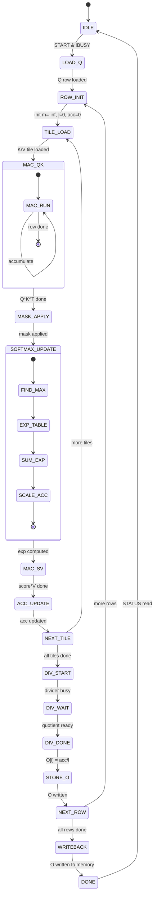

# FlashAttention 加速器 IP — 设计细节

## 1. 模块详细设计

### 1.1 fa_ctrl — 主控制器

#### 1.1.1 状态机



#### 1.1.2 计数器

| 计数器 | 位宽 | 说明 |
|--------|------|------|
| row_cnt | 8 | 当前行索引 (0..255) |
| tile_cnt | 4 | 当前 tile 索引 (0..15) |
| elem_cnt | 6 | tile 内元素计数 (0..63) |
| div_cnt | 4 | 除法迭代计数 (0..15) |
| cycle_cnt | 32 | 总周期计数 |

#### 1.1.3 控制信号

| 信号 | 方向 | 说明 |
|------|------|------|
| dma_start | Output | DMA 启动命令 |
| dma_done | Input | DMA 完成 |
| mac_start | Output | MAC 启动 |
| mac_done | Input | MAC 完成 |
| sm_start | Output | Softmax 启动 |
| sm_done | Input | Softmax 完成 |
| div_start | Output | 除法启动 |
| div_done | Input | 除法完成 |

---

### 1.2 fa_dma — DMA 引擎

#### 1.2.1 架构

```
fa_dma
├── axi4_master_if      // AXI4 Master 接口
├── addr_gen            // 地址生成器
├── burst_ctrl          // 突发控制
├── data_buffer         // 数据缓冲
└── cmd_queue           // 命令队列
```

#### 1.2.2 DMA 命令格式

| 字段 | 位宽 | 说明 |
|------|------|------|
| CMD_TYPE | 2 | 00=Read Q, 01=Read K, 10=Read V, 11=Write O |
| ADDR | 64 | 起始地址 |
| BURST_LEN | 8 | 突发长度-1 |
| ROW_INDEX | 8 | 行索引 (用于地址计算) |
| TILE_INDEX | 4 | Tile 索引 (K/V 时有效) |

#### 1.2.3 地址计算

```
Q 地址 = Q_BASE + row_cnt * STRIDE
K 地址 = K_BASE + tile_cnt * Bc * STRIDE
V 地址 = V_BASE + tile_cnt * Bc * STRIDE
O 地址 = O_BASE + row_cnt * STRIDE
```

#### 1.2.4 突发配置

| 参数 | 值 | 说明 |
|------|-----|------|
| DATA_WIDTH | 128 bit | AXI4 数据宽度 |
| MAX_BURST | 16 | AXI4 最大突发长度 |
| BURST_TYPE | INCR | 增量突发 |

---

### 1.3 fa_systolic — MAC 阵列

#### 1.3.1 架构

采用 16-wide 向量 MAC 阵列, 每个 MAC 单元计算 16-bit * 16-bit -> 40-bit。

```
fa_systolic
├── mac_array[16]       // 16 个 MAC 单元
├── accumulator[64]     // 64 个 40-bit 累加器
├── input_mux           // 输入多路选择
└── output_mux          // 输出多路选择
```

#### 1.3.2 MAC 单元

```
mac_unit
├── multiplier (16x16->32)
├── adder (32+40->40)
└── register (40-bit)
```

时序: 1 cycle/instruction, 流水线可满载。

#### 1.3.3 操作模式

| 模式 | 说明 | 输入 |
|------|------|------|
| QK_MAC | Q[i] * K_tile^T | Q[64], K_tile[16][64] |
| SV_MAC | score * V_tile | score[16], V_tile[16][64] |

#### 1.3.4 计算流程 (Q*K^T)

```
For k = 0 to 63:  // d 维度
  For j = 0 to 15:  // Bc 维度
    mac_array[j] += Q[i][k] * K_tile[j][k]
```

每个 cycle 处理 16 个 MAC, 总计 64 cycles 完成一行 Q*K^T。

---

### 1.4 fa_softmax — 在线 Softmax 单元

#### 1.4.1 架构

```
fa_softmax
├── max_comparator      // 树形最大值比较器
├── exp_lut             // 256-entry exp 查找表
├── linear_interp       // 分段线性插值
├── sum_accumulator     // 累加器
└── scale_multiplier    // 缩放乘法器
```

#### 1.4.2 Exp 查找表

| 参数 | 值 |
|------|-----|
| 表大小 | 256 entries |
| 输入范围 | [-8.0, 0.0] (Q8.8) |
| 输出格式 | Q8.8 (16-bit) |
| 存储 | ROM, ~512B |

#### 1.4.3 分段线性插值

将输入区间 [-8, 0] 分为 256 段, 每段宽度 8/256 = 0.03125。

```
exp(x) ≈ LUT[index] + (x - x_index) * (LUT[index+1] - LUT[index]) / step
```

其中 index = (x + 8) / step。

#### 1.4.4 在线更新算法

```
输入: score[16] (当前 tile 的 score 值)
状态: m_old, l_old, acc_old

1. m_new = max(m_old, max(score))
2. correction = exp(m_old - m_new)
3. l_new = correction * l_old + sum(exp(score - m_new))
4. acc_new[j] = correction * acc_old[j] + sum(exp(score - m_new) * V_tile[j])
5. 更新状态: m_old = m_new, l_old = l_new, acc_old = acc_new
```

#### 1.4.5 时序

| 阶段 | Cycles | 说明 |
|------|--------|------|
| max 比较 | 1 | 树形比较器 |
| exp 查表 | 2 | ROM 读 + 插值 |
| 累加 | 1 | 加法器 |
| **总计** | **4** | 每个 score 元素 |

16 个 score 元素并行处理: 4 cycles/tile。

---

### 1.5 fa_divider — 迭代除法器

#### 1.5.1 架构

采用 SRT (Sweeney-Robertson-Tocher) 迭代除法器。

```
fa_divider
├── dividend_reg        // 被除数 (acc)
├── divisor_reg         // 除数 (l)
├── quotient_reg        // 商寄存器
├── remainder_reg       // 余数寄存器
├── iteration_ctrl      // 迭代控制
└── quotient_sel        // 商选择逻辑
```

#### 1.5.2 参数

| 参数 | 值 |
|------|-----|
| 被除数位宽 | 40-bit |
| 除数位宽 | 40-bit |
| 商位宽 | 16-bit (Q8.8) |
| 迭代次数 | 16 (固定) |
| 延迟 | 16 cycles |

#### 1.5.3 操作流程

```
1. 加载被除数 acc[j] (40-bit)
2. 加载除数 l (40-bit)
3. 固定 16 次迭代计算商
4. 输出 O[i][j] = quotient (16-bit Q8.8)
5. 重复 64 次 (d=64 元素)
```

#### 1.5.4 共享策略

每行计算结束时, 64 个元素共享一个除法器:
- 总延迟 = 64 * 16 = 1024 cycles (固定)
- 可优化: 流水线化, 每 cycle 启动一个新除法

---

### 1.6 fa_buffer_mgr — Buffer 管理器

#### 1.6.1 存储分配

| Buffer | 大小 | 用途 |
|--------|------|------|
| q_buf | 128B (64*2B) | 当前 Q 行 |
| k_buf | 2KB (16*64*2B) | 当前 K tile |
| v_buf | 2KB (16*64*2B) | 当前 V tile |
| o_buf | 128B (64*2B) | 当前 O 行输出 |
| exp_lut | 512B (256*2B) | exp 查找表 |

#### 1.6.2 访问仲裁

| 请求源 | 优先级 | 说明 |
|--------|--------|------|
| MAC 读 | 最高 | 计算流水线不能停 |
| DMA 写 | 高 | 数据输入 |
| Softmax 读 | 中 | exp 查表 |
| Divider 读 | 低 | 归一化 |

#### 1.6.3 双缓冲策略

为 K/V tile 实现简单双缓冲:
- 当前 tile 计算时, DMA 预取下一个 tile
- 减少 DMA 延迟对计算的影响

---

### 1.7 fa_regfile — 寄存器文件

#### 1.7.1 架构

```
fa_regfile
├── axil_slave_if       // AXI4-Lite 从接口
├── reg_array[16]       // 16 个 32-bit 寄存器
├── decode_logic        // 地址解码
└── w1c_logic           // Write-1-to-Clear 逻辑
```

#### 1.7.2 访问规则

| 寄存器 | 写条件 | 读条件 |
|--------|--------|--------|
| CTRL | !BUSY 时可写 | 始终可读 |
| STATUS | W1C: DONE, ERROR | 始终可读 |
| CFG | !BUSY 时可写 | 始终可读 |
| *_BASE | !BUSY 时可写 | 始终可读 |
| STRIDE | !BUSY 时可写 | 始终可读 |
| NEG_LARGE | !BUSY 时可写 | 始终可读 |
| SCALE | !BUSY 时可写 | 始终可读 |
| CYCLES | 不可写 | 始终可读 |

#### 1.7.3 写保护

当 STATUS.BUSY = 1 时, 除 STATUS (W1C) 外所有寄存器写被忽略。

---

## 2. 关键设计决策

### 2.1 面积优化

| 决策 | 理由 |
|------|------|
| 单 head | 减少并行度, 面积友好 |
| Bc=16 | 平衡 buffer 面积和 DMA 效率 |
| 迭代除法器 | 面积小, 延迟可接受 |
| 共享除法器 | 64 元素共享, 节面积 |

### 2.2 性能优化

| 决策 | 理由 |
|------|------|
| 16-wide MAC | 每 cycle 16 个 MAC |
| DMA 预取 | 隐藏 DMA 延迟 |
| 流水线 | 计算和 DMA 重叠 |
| Exp LUT | 2 cycles 查表, 快速 |

### 2.3 数值精度

| 决策 | 理由 |
|------|------|
| 40-bit 累加 | 防溢出 |
| 在线 softmax | 数值稳定 |
| Exp 插值 | 提高查表精度 |
| 饱和保护 | 防止溢出传播 |
