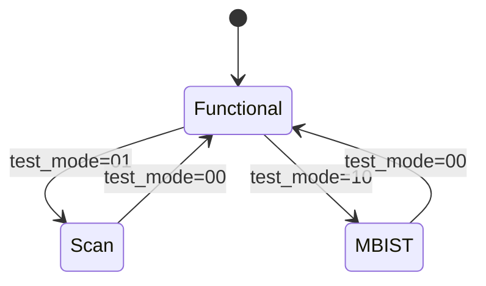

# FlashAttention 加速器 IP — DFT 可测试性设计

## 1. DFT 策略概述

### 1.1 DFT 目标

| 目标 | 指标 |
|------|------|
| Stuck-at Coverage | >= 95% |
| Transition Coverage | >= 90% |
| Memory BIST | 100% SRAM 覆盖 |
| 测试时间 | < 10ms (典型) |

### 1.2 DFT 方法选择

| 方法 | 适用范围 | 说明 |
|------|----------|------|
| Scan Insertion | 全部逻辑 | 标准 scan cell, 通过 test_se/test_si/test_so 引脚访问 |
| Memory BIST | SRAM | March C- 算法 |

---

## 2. Scan 设计

### 2.1 Scan Chain 配置

| 参数 | 值 | 说明 |
|------|-----|------|
| Scan Chain 数量 | 8 | 匹配 ATE 通道 |
| Chain 长度 | ~1000 | 均匀分配 |
| Scan Clock | clk | 复用功能时钟 |
| Scan Enable | test_se | 专用测试信号 |

### 2.2 Scan Chain 分配

| Chain | 覆盖模块 | 估算长度 |
|-------|----------|----------|
| chain_0 | fa_ctrl | ~500 |
| chain_1 | fa_ctrl | ~500 |
| chain_2 | fa_dma | ~1500 |
| chain_3 | fa_dma | ~1500 |
| chain_4 | fa_systolic | ~2000 |
| chain_5 | fa_systolic | ~2000 |
| chain_6 | fa_softmax + fa_divider | ~1500 |
| chain_7 | fa_buffer_mgr + fa_regfile | ~1000 |

### 2.3 Scan Cell 类型

使用 ASAP7 库提供的 Mux-D Flip-Flop:
- `asap7sc7p5t_27/.../DFFHQNx1_ASAP7_75t_SL`
- 标准 scan cell, 支持 SE (Scan Enable) 端口

### 2.4 Scan 插入时机

| 时机 | 工具 | 说明 |
|------|------|------|
| 综合阶段 | Yosys + DFT 插入脚本 | RTL 后综合时插入 |

---

## 3. Memory BIST

### 3.1 SRAM 列表

| SRAM | 大小 | 类型 | BIST |
|------|------|------|------|
| q_buf | 128B | Single-port | Yes |
| k_buf | 2KB | Single-port | Yes |
| v_buf | 2KB | Single-port | Yes |
| o_buf | 128B | Single-port | Yes |
| exp_lut | 512B | ROM | Signature |

### 3.2 BIST 算法

| 存储类型 | 算法 | 覆盖 |
|----------|------|------|
| SRAM | March C- | 100% stuck-at |
| ROM | Signature Analysis | 100% |

### 3.3 BIST 控制器

```
mbist_ctrl
├── algo_engine       // March C- 状态机
├── addr_gen          // 地址生成器
├── data_gen          // 数据生成器
├── comparator        // 比较器
└── result_reg        // 结果寄存器
```

---

## 4. 测试模式

### 4.1 模式定义

| 模式 | 入口 | 说明 |
|------|------|------|
| Functional | 默认 | 正常功能 |
| Scan | test_mode=1, test_se=1 | Scan 测试 |
| MBIST | test_mode=2 | Memory BIST |

> JTAG (IEEE 1149.1 Boundary Scan) 已移除以简化设计。Scan chain 通过专用 test_se/test_si/test_so 引脚直接访问。

### 4.2 测试引脚

| 引脚 | 方向 | 说明 |
|------|------|------|
| test_mode[1:0] | Input | 测试模式选择 |
| test_se | Input | Scan Enable |
| test_si[7:0] | Input | Scan Input (8 chains) |
| test_so[7:0] | Output | Scan Output (8 chains) |

### 4.3 模式切换



---

## 5. ATPG 要求

### 5.1 故障模型

| 模型 | 覆盖目标 |
|------|----------|
| Stuck-at 0/1 | >= 95% |
| Transition | >= 90% |
| Path Delay | >= 80% (关键路径) |

### 5.2 ATPG 向量

| 类型 | 数量估算 | 说明 |
|------|----------|------|
| Stuck-at | ~10,000 | 随机 + 定向 |
| Transition | ~5,000 | 速度相关 |
| **总计** | **~15,000** | |

### 5.3 测试时间估算

```
Scan chains: 8
Chain length: ~1000
Clock period: 20ns (50MHz)
Shift cycles: 1000
Capture cycles: 10
Vectors: 15,000

Test time = 15000 * (1000 + 10) * 20ns / 8 chains
         ≈ 37.8 ms
```

---

## 6. DFT 验证清单

| 检查项 | 方法 | 标准 |
|--------|------|------|
| Scan Chain 连接 | Simulation | 无断裂 |
| Scan Shift | Simulation | 数据正确移入/移出 |
| Scan Capture | Simulation | 正确捕获状态 |
| Memory BIST | Simulation | March C- 通过 |
| Coverage | ATPG | >= 95% stuck-at |
