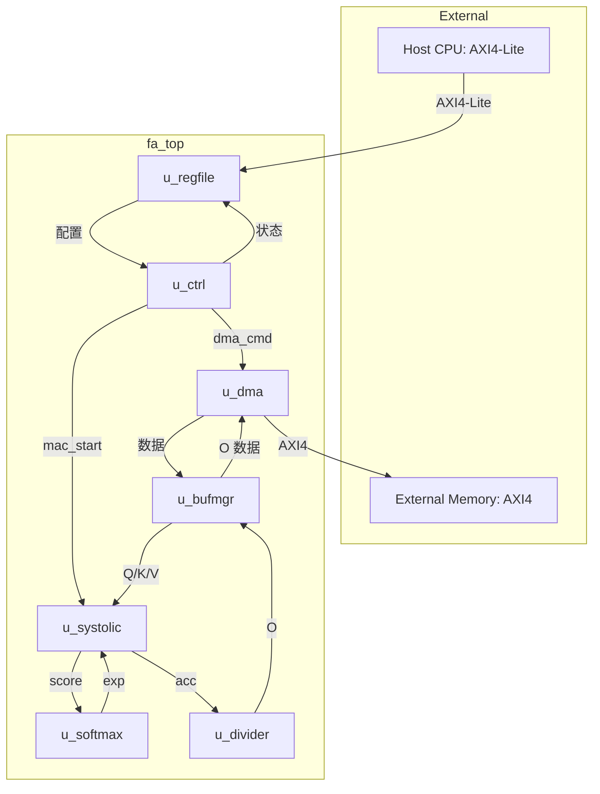
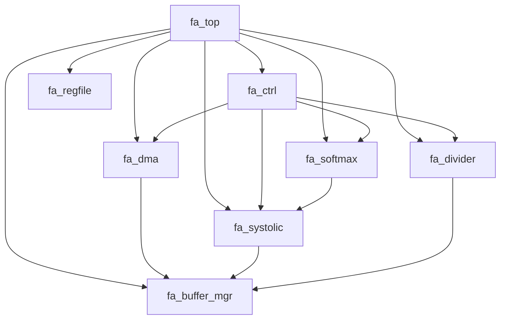

# fa_top 微架构规范

## 1. 模块概述

### 1.1 功能描述
FlashAttention 加速器顶层封装。例化所有子模块, 聚合 AXI4-Lite 从接口和 AXI4 Master 接口, 连接内部数据通路和控制通路。

### 1.2 模块类型
- 类型: `io` (顶层接口聚合)
- 层级: L0 (顶层)

### 1.3 设计约束
- 总面积预算: <= 1.8M gates (2M 上限)
- 总功耗预算: <= 50 mW 动态
- 时钟频率: 50 MHz
- PDK: ASAP7 7nm

---

## 2. 接口定义

### 2.1 顶层端口

| 端口名 | 方向 | 位宽 | 说明 |
|--------|------|------|------|
| `clk` | Input | 1 | 系统时钟 50 MHz |
| `rst_n` | Input | 1 | 异步复位, 低有效 |
| `test_mode` | Input | 2 | 测试模式选择 |
| `test_se` | Input | 1 | Scan Enable |
| `test_si[7:0]` | Input | 8 | Scan Input |
| `test_so[7:0]` | Output | 8 | Scan Output |
| `s_axil_*` | -- | -- | AXI4-Lite 从接口 (见 M08) |
| `m_axi_*` | -- | -- | AXI4 Master 接口 (见 M03) |

### 2.2 子模块接口连接

| 子模块 | 连接 | 说明 |
|--------|------|------|
| fa_regfile | s_axil_* | AXI4-Lite 外部接口 |
| fa_dma | m_axi_* | AXI4 Master 外部接口 |
| fa_ctrl | regfile <-> ctrl | 配置/状态 |
| fa_dma | ctrl <-> dma | DMA 命令/状态 |
| fa_systolic | buffer <-> mac | 数据 |
| fa_softmax | mac <-> softmax | score/exp |
| fa_divider | acc <-> div | 除法 |
| fa_buffer_mgr | all <-> buffer | 数据仲裁 |

---

## 3. 子模块编排

### 3.1 子模块实例表

| 实例名 | 模块 | 功能 |
|--------|------|------|
| `u_regfile` | fa_regfile | AXI4-Lite 寄存器 |
| `u_ctrl` | fa_ctrl | 主控制器 |
| `u_dma` | fa_dma | DMA 引擎 |
| `u_systolic` | fa_systolic | MAC 阵列 |
| `u_softmax` | fa_softmax | Softmax |
| `u_divider` | fa_divider | 除法器 |
| `u_bufmgr` | fa_buffer_mgr | Buffer 管理 |

### 3.2 连接图

---

## 4. 子模块依赖关系

---

## 5. 时钟与复位

### 5.1 时钟架构
- 单时钟域: clk (50 MHz)
- 所有子模块共享同一时钟

### 5.2 复位架构
- 异步置位同步释放
- rst_n -> rst_n_sync -> 所有子模块

---

## 6. DFT 顶层

### 6.1 Scan Chain 汇总

| Chain | 覆盖模块 | 长度 |
|-------|----------|------|
| chain_0 | fa_ctrl | ~500 |
| chain_1 | fa_ctrl | ~500 |
| chain_2 | fa_dma | ~1500 |
| chain_3 | fa_dma | ~1500 |
| chain_4 | fa_systolic | ~2000 |
| chain_5 | fa_systolic | ~2000 |
| chain_6 | fa_softmax + fa_divider | ~1500 |
| chain_7 | fa_buffer_mgr + fa_regfile | ~1000 |

### 6.2 MBIST 汇总

| BIST | 目标 | 算法 |
|------|------|------|
| MBIST-001~004 | q/k/v/o_buf | March C- |
| MBIST-005 | exp_lut | Signature |

---

## 7. 验证要点

详见 [verification.md](./verification.md)

---

## 8. 实现任务

详见 [tasks.md](./tasks.md)

---

## 9. 需求追踪矩阵

| REQ_ID | 需求描述 | 优先级 | 验收标准 | 边界条件 | RTL 组件 | 测试用例 |
|--------|---------|--------|---------|---------|---------|---------|
| REQ-M01-F01 | 顶层端口完整 | P1 | 所有 AXI 信号连接 | -- | fa_top | TC-M01-01 |
| REQ-M01-F02 | 子模块例化 | P1 | 7 个子模块正确连接 | -- | fa_top | TC-M01-02 |
| REQ-M01-F03 | 时钟复位连接 | P1 | 所有模块共享 clk/rst_n | -- | fa_top | TC-M01-03 |
| REQ-M01-F04 | Scan chain 连接 | P1 | 8 条 scan chain | -- | fa_top | TC-M01-04 |
| REQ-M01-F05 | 端到端功能 | P1 | Q/K/V -> O 正确 | S=256, d=64 | fa_top | TC-M01-05 |
