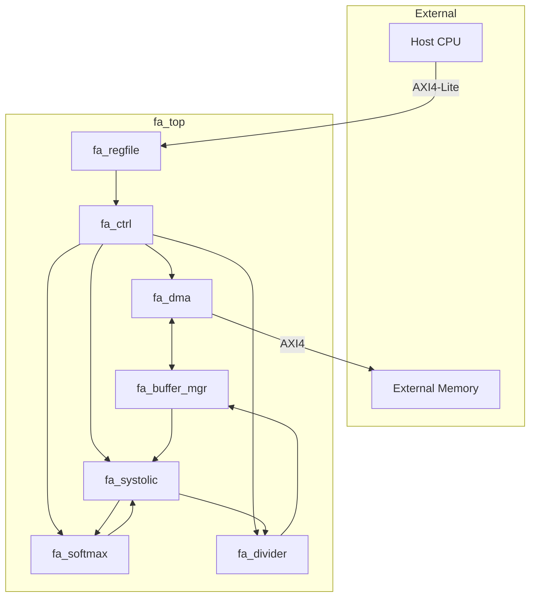

# fa_top 数据通路设计

## 1. 概述
顶层封装, 无自身数据通路。数据通路由各子模块实现。

## 2. 子模块连接图

## 3. 数据流

| 阶段 | 源 | 目标 | 数据 | 位宽 |
|------|----|------|------|------|
| Load Q | External Memory | q_buf | Q[256,64] | 128-bit AXI |
| Load K | External Memory | k_buf | K tile | 128-bit AXI |
| Load V | External Memory | v_buf | V tile | 128-bit AXI |
| Q*K^T | q_buf, k_buf | mac_array | Q[64], K[16][64] | 256-bit |
| Softmax | mac_array | softmax | score[16] | 256-bit |
| score*V | softmax, v_buf | mac_array | score[16], V[16][64] | 256-bit |
| Div | mac_array | divider | acc[64] | 640-bit |
| Store O | o_buf | External Memory | O[256,64] | 128-bit AXI |
