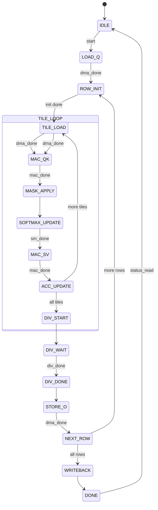

# fa_ctrl 状态机设计

## 1. FSM 概述

| FSM 名称 | 类型 | 状态数 | 描述 |
|----------|------|--------|------|
| `main_fsm` | Moore | 18 | FlashAttention 主控制流程 |

## 2. main_fsm 详细设计

### 2.1 状态定义

| 状态名 | 编码 | 描述 |
|--------|------|------|
| `IDLE` | 0x00 | 空闲, 等待 START |
| `LOAD_Q` | 0x01 | DMA 加载 Q[256,64] |
| `ROW_INIT` | 0x02 | 行初始化: m=-inf, l=0, acc=0 |
| `TILE_LOAD` | 0x03 | DMA 加载 K/V tile |
| `MAC_QK` | 0x04 | Q*K^T MAC 计算 (64 cycles) |
| `MASK_APPLY` | 0x05 | Causal mask 应用 |
| `SOFTMAX_UPDATE` | 0x06 | 在线 softmax 更新 |
| `MAC_SV` | 0x07 | score*V MAC 计算 (64 cycles) |
| `ACC_UPDATE` | 0x08 | 累加器更新 |
| `NEXT_TILE` | 0x09 | 判断是否还有 tile |
| `DIV_START` | 0x0A | 启动除法器 |
| `DIV_WAIT` | 0x0B | 等待除法完成 (1024 cycles) |
| `DIV_DONE` | 0x0C | 除法完成 |
| `STORE_O` | 0x0D | DMA 写回 O[i] |
| `NEXT_ROW` | 0x0E | 判断是否还有行 |
| `WRITEBACK` | 0x0F | 最终写回 |
| `DONE` | 0x10 | 计算完成 |
| `ERROR` | 0x11 | 错误状态 |

### 2.2 状态转移表

| # | 当前 | 条件 | 目标 | 输出 |
|---|------|------|------|------|
| 1 | IDLE | start && !busy | LOAD_Q | busy=1, dma_start, dma_cmd=Q |
| 2 | LOAD_Q | dma_done | ROW_INIT | acc_clear, m_init=-inf |
| 3 | ROW_INIT | always | TILE_LOAD | dma_start, dma_cmd=K/V |
| 4 | TILE_LOAD | dma_done | MAC_QK | mac_start, mac_mode=QK |
| 5 | MAC_QK | mac_done | MASK_APPLY | -- |
| 6 | MASK_APPLY | always | SOFTMAX_UPDATE | sm_start |
| 7 | SOFTMAX_UPDATE | sm_done | MAC_SV | mac_start, mac_mode=SV |
| 8 | MAC_SV | mac_done | ACC_UPDATE | -- |
| 9 | ACC_UPDATE | always | NEXT_TILE | -- |
| 10 | NEXT_TILE | tile_cnt < 15 | TILE_LOAD | tile_cnt++, buf_sel翻转 |
| 11 | NEXT_TILE | tile_cnt == 15 | DIV_START | div_start |
| 12 | DIV_START | always | DIV_WAIT | -- |
| 13 | DIV_WAIT | div_done | DIV_DONE | -- |
| 14 | DIV_DONE | always | STORE_O | dma_start, dma_cmd=O |
| 15 | STORE_O | dma_done | NEXT_ROW | -- |
| 16 | NEXT_ROW | row_cnt < 255 | ROW_INIT | row_cnt++, tile_cnt=0 |
| 17 | NEXT_ROW | row_cnt == 255 | WRITEBACK | -- |
| 18 | WRITEBACK | always | DONE | done=1 |
| 19 | DONE | status_read | IDLE | busy=0 |
| 20 | any | soft_reset | IDLE | 全部复位 |

### 2.3 子状态机

#### SOFTMAX_UPDATE 子状态
| 状态 | 描述 |
|------|------|
| FIND_MAX | 树形比较 |
| EXP_TABLE | ROM 查表 |
| SUM_EXP | 累加 |
| SCALE_ACC | 缩放 |

#### MAC_QK / MAC_SV 子状态
| 状态 | 描述 |
|------|------|
| MAC_RUN | 64 cycles 计算 |
| MAC_DONE | 完成 |

## 3. 状态图 (Mermaid)



## 4. 异常处理

| 异常 | 触发 | 处理 |
|------|------|------|
| DMA 超时 | dma_done 未响应 | error=1, 进入 ERROR |
| 除法器异常 | div_done 超时 | error=1, 进入 ERROR |
| 软复位 | soft_reset | 回到 IDLE |

## 5. RTL 实现建议

```systemverilog
// 主 FSM: 三段式
always_ff @(posedge clk or negedge rst_n) begin
    if (!rst_n) state <= IDLE;
    else if (soft_reset) state <= IDLE;
    else state <= next_state;
end

// 行计数器
always_ff @(posedge clk or negedge rst_n) begin
    if (!rst_n) row_cnt <= 8'd0;
    else if (state == NEXT_ROW && row_cnt < 8'd255)
        row_cnt <= row_cnt + 1;
    else if (state == IDLE) row_cnt <= 8'd0;
end

// tile 计数器
always_ff @(posedge clk or negedge rst_n) begin
    if (!rst_n) tile_cnt <= 4'd0;
    else if (state == NEXT_TILE && tile_cnt < 4'd15)
        tile_cnt <= tile_cnt + 1;
    else if (state == ROW_INIT) tile_cnt <= 4'd0;
end

// 周期计数器
always_ff @(posedge clk or negedge rst_n) begin
    if (!rst_n) cycle_cnt <= 32'd0;
    else if (state == IDLE) cycle_cnt <= 32'd0;
    else cycle_cnt <= cycle_cnt + 1;
end
```
