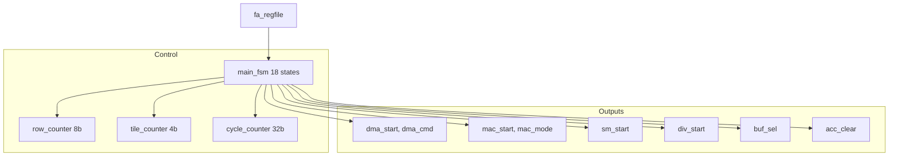

# fa_ctrl 数据通路设计

## 1. 概述
主控制器, 无数据通路, 纯控制逻辑。

## 2. 模块框图



## 3. 控制信号时序

```
IDLE -> LOAD_Q:     dma_start=1, dma_cmd=Q (持续到 dma_done)
LOAD_Q -> ROW_INIT: acc_clear=1 (脉冲)
ROW_INIT -> TILE_LOAD: dma_start=1, dma_cmd=K/V
TILE_LOAD -> MAC_QK: mac_start=1, mac_mode=0
MAC_QK -> SOFTMAX:   sm_start=1
SOFTMAX -> MAC_SV:   mac_start=1, mac_mode=1
MAC_SV -> NEXT_TILE: -- (检查 tile_cnt)
NEXT_TILE -> DIV:    div_start=1
DIV -> STORE_O:      dma_start=1, dma_cmd=O
STORE_O -> NEXT_ROW: -- (检查 row_cnt)
NEXT_ROW -> DONE:    done=1
```

## 4. 计数器逻辑

| 计数器 | 递增条件 | 复位条件 | 溢出处理 |
|--------|----------|----------|----------|
| row_cnt | NEXT_ROW && < 255 | IDLE, ROW_INIT | 到 255 时触发 WRITEBACK |
| tile_cnt | NEXT_TILE && < 15 | ROW_INIT | 到 15 时触发 DIV_START |
| cycle_cnt | 非 IDLE 状态 | IDLE | 32-bit 自然溢出 |
