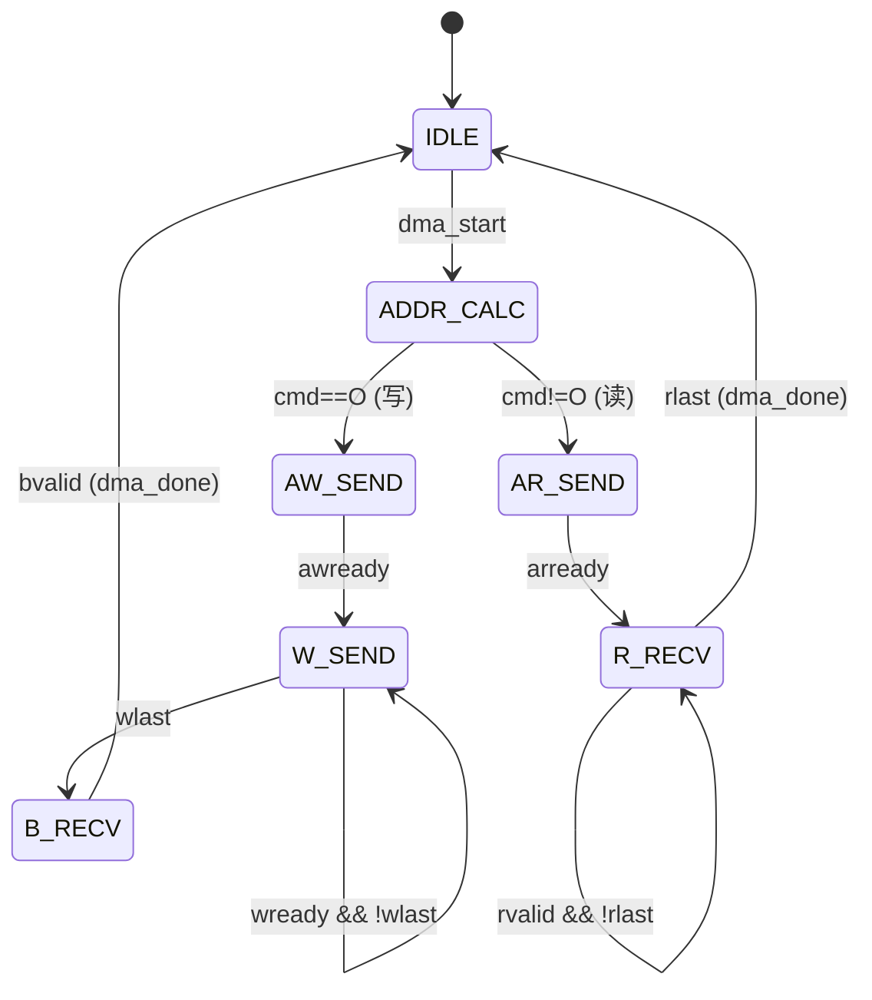

# fa_dma 状态机设计

## 1. FSM 概述

| FSM 名称 | 类型 | 状态数 | 描述 |
|----------|------|--------|------|
| `dma_fsm` | Moore | 7 | DMA 传输控制 |

## 2. dma_fsm 详细设计

### 2.1 状态定义

| 状态名 | 编码 | 描述 |
|--------|------|------|
| `IDLE` | `000` | 空闲 |
| `ADDR_CALC` | `001` | 地址计算 |
| `AR_SEND` | `010` | 发送读地址 (AXI AR) |
| `R_RECV` | `011` | 接收读数据 (AXI R) |
| `AW_SEND` | `100` | 发送写地址 (AXI AW) |
| `W_SEND` | `101` | 发送写数据 (AXI W) |
| `B_RECV` | `110` | 接收写响应 (AXI B) |

### 2.2 状态转移表

| # | 当前 | 条件 | 目标 | 输出 |
|---|------|------|------|------|
| 1 | IDLE | dma_start | ADDR_CALC | 锁存 cmd, row_cnt, tile_cnt |
| 2 | ADDR_CALC | cmd!=O | AR_SEND | araddr=计算地址, arlen=burst_len |
| 3 | ADDR_CALC | cmd==O | AW_SEND | awaddr=计算地址, awlen=burst_len |
| 4 | AR_SEND | arready | R_RECV | arvalid=0 |
| 5 | R_RECV | rlast && rvalid | IDLE | dma_done=1 |
| 6 | R_RECV | rvalid && !rlast | R_RECV | buf_wr_en=1, buf_wr_addr++ |
| 7 | AW_SEND | awready | W_SEND | awvalid=0 |
| 8 | W_SEND | wlast && wready | B_RECV | wvalid=0 |
| 9 | W_SEND | wready | W_SEND | buf_rd_addr++, wvalid=1 |
| 10 | B_RECV | bvalid | IDLE | bready=1, dma_done=1 |

### 2.3 突发长度计算

| 命令 | 数据量 | 突发长度 (awlen/arlen) |
|------|--------|----------------------|
| Q | 128B | 7 (8 beats) |
| K | 256B | 15 (16 beats) |
| V | 256B | 15 (16 beats) |
| O | 128B | 7 (8 beats) |

## 3. 状态图



## 4. 地址计算逻辑

```systemverilog
always_comb begin
    case (dma_cmd)
        CMD_Q: addr = q_base + row_cnt * stride;
        CMD_K: addr = k_base + tile_cnt * Bc * stride;
        CMD_V: addr = v_base + tile_cnt * Bc * stride;
        CMD_O: addr = o_base + row_cnt * stride;
    endcase
end
```
