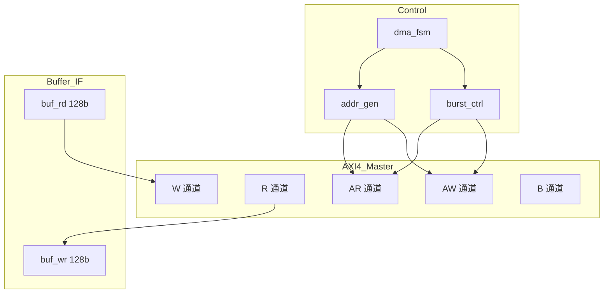

# fa_dma 数据通路设计

## 1. 概述
AXI4 Master DMA 引擎, 实现外部内存与片上 buffer 之间的数据搬运。

## 2. 模块框图



## 3. 数据格式

| 数据 | 位宽 | 说明 |
|------|------|------|
| AXI4 数据 | 128-bit | 8 个 Q8.8 元素 |
| Buffer 数据 | 128-bit | 8 个 Q8.8 元素 |

## 4. 地址生成

```systemverilog
// 地址计算
wire [63:0] q_addr  = q_base + row_cnt * stride;
wire [63:0] k_addr  = k_base + tile_cnt * 16 * stride;
wire [63:0] v_addr  = v_base + tile_cnt * 16 * stride;
wire [63:0] o_addr  = o_base + row_cnt * stride;

// 突发内地址递增
always_ff @(posedge clk) begin
    if (state == R_RECV && rvalid)
        buf_wr_addr <= buf_wr_addr + 1;
    if (state == W_SEND && wready)
        buf_rd_addr <= buf_rd_addr + 1;
end
```

## 5. 关键路径

| 路径 | 延迟 |
|------|------|
| addr_gen -> AXI AR | 2 cycles |
| AXI R -> buf_wr | 1 cycle |
| buf_rd -> AXI W | 1 cycle |
