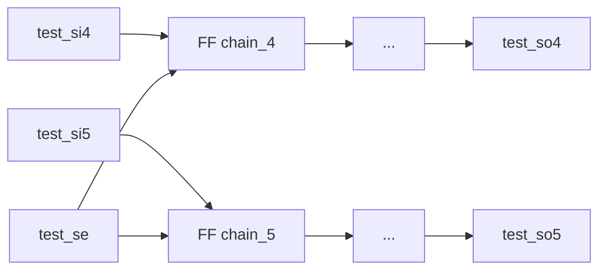
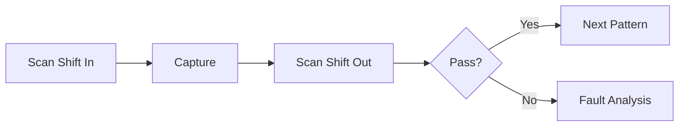

# fa_systolic 可测性设计方案

## 1. DFT 概述

### 1.1 DFT 目标
- Stuck-at Coverage: >= 95%
- Transition Coverage: >= 90%
- 测试时间: < 5ms (本模块)

### 1.2 DFT 策略
- 结构测试: Scan Insertion
- 本模块无 SRAM, 无需 MBIST

---

## 2. 扫描链设计

### 2.1 扫描链配置

| 链 ID | 长度 | 触发器数 | 时钟域 | 用途 |
|--------|------|---------|--------|------|
| `chain_4` | ~2000 | ~2000 | clk_domain | MAC 阵列逻辑 |
| `chain_5` | ~2000 | ~2000 | clk_domain | 累加器 + 控制 |

### 2.2 扫描链架构

### 2.3 扫描寄存器映射

| 寄存器 | 扫描链位置 | 功能 | 测试访问 |
|--------|-----------|------|----------|
| `state` | chain_4[0:1] | FSM 状态 | scan shift |
| `elem_cnt` | chain_4[2:7] | 元素计数器 | scan shift |
| `acc_reg[0..15]` | chain_5[0:639] | 累加器 (16x40) | scan shift |

---

## 3. 内建自测试 (BIST)

本模块无 SRAM, 不需要 MBIST。

---

## 4. 测试模式

### 4.1 模式定义

| 模式 | 入口 | 说明 |
|------|------|------|
| Functional | test_mode=0 | 正常 MAC 计算 |
| Scan | test_mode=1, test_se=1 | Scan 测试 |

### 4.2 测试引脚

| 引脚 | 方向 | 说明 |
|------|------|------|
| `test_mode` | Input | 测试模式选择 |
| `test_se` | Input | Scan Enable |
| `test_si[4:5]` | Input | Scan Input (2 chains) |
| `test_so[4:5]` | Output | Scan Output (2 chains) |

---

## 5. 故障模型

### 5.1 故障类型

| 故障类型 | 模型 | 检测方法 |
|----------|------|----------|
| Stuck-at | SAF | 扫描测试 |
| Transition | TDF | 扫描测试 |

### 5.2 故障覆盖率目标

| 故障模型 | 目标覆盖率 |
|----------|-----------|
| Stuck-at | >= 95% |
| Transition | >= 90% |

---

## 6. 测试流程

### 6.1 测试序列

### 6.2 测试向量估算

| 类型 | 数量 | 说明 |
|------|------|------|
| Stuck-at | ~3000 | MAC + 累加器 |
| Transition | ~1500 | 速度相关 |
| **总计** | **~4500** | |
