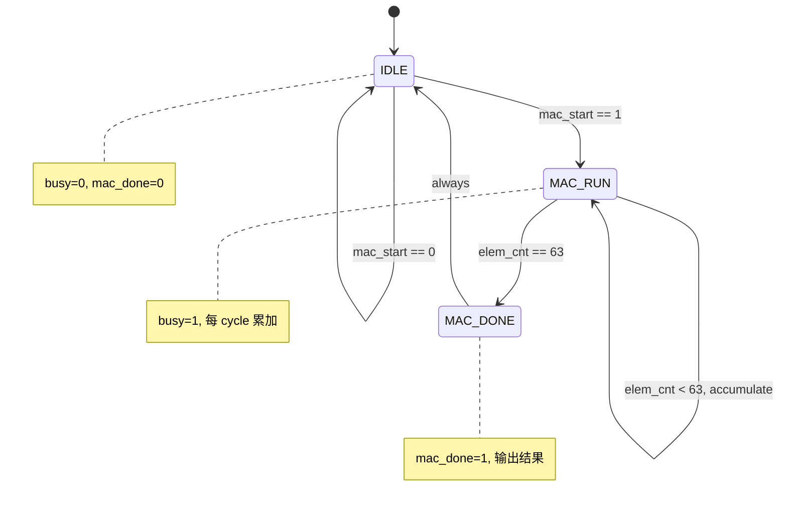

# fa_systolic 状态机设计

## 1. FSM 概述

### 1.1 状态机列表

| FSM 名称 | 类型 | 状态数 | 描述 |
|----------|------|--------|------|
| `mac_fsm` | Moore | 4 | MAC 阵列计算控制 |

---

## 2. mac_fsm 详细设计

### 2.1 状态定义

| 状态名 | 编码 (二进制) | 编码 (十六进制) | 描述 |
|--------|--------------|----------------|------|
| `IDLE` | `00` | `0x0` | 空闲, 等待启动 |
| `MAC_RUN` | `01` | `0x1` | MAC 计算中, 处理 64 个元素 |
| `MAC_DONE` | `10` | `0x2` | 计算完成, 输出结果 |

### 2.2 状态编码策略
- 编码方式: `binary`
- 选择理由: 状态数少, binary 编码面积最小

### 2.3 状态转移表

| # | 当前状态 | 转移条件 | 目标状态 | 输出变化 | 延迟 |
|---|----------|---------|----------|----------|------|
| 1 | `IDLE` | `mac_start == 1` | `MAC_RUN` | `busy = 1, elem_cnt = 0` | 1 cycle |
| 2 | `MAC_RUN` | `elem_cnt == 63` | `MAC_DONE` | `mac_done = 1` | 1 cycle |
| 3 | `MAC_RUN` | `elem_cnt < 63` | `MAC_RUN` | `elem_cnt++, accumulate` | 1 cycle |
| 4 | `MAC_DONE` | `always` | `IDLE` | `busy = 0` | 1 cycle |

### 2.4 输出函数

| 状态 | 输出信号 | 输出值 | Moore/Mealy |
|------|----------|--------|-------------|
| `IDLE` | `busy` | `0` | Moore |
| `IDLE` | `mac_done` | `0` | Moore |
| `MAC_RUN` | `busy` | `1` | Moore |
| `MAC_RUN` | `accumulate` | `1` | Moore |
| `MAC_DONE` | `mac_done` | `1` | Moore |

---

## 3. 状态图 (Mermaid)



---

## 4. 转移条件详细定义

### 4.1 条件表达式

| 条件名 | 表达式 | 描述 |
|--------|--------|------|
| `start_cond` | `mac_start && !busy` | 启动条件: 启动信号且非忙 |
| `done_cond` | `elem_cnt == 6'd63` | 完成条件: 已处理 64 个元素 |
| `run_cond` | `elem_cnt < 6'd63` | 继续条件: 还有元素待处理 |

### 4.2 条件优先级
1. 复位 (rst_n) 最高优先级
2. done_cond 优先于 run_cond

---

## 5. 异常处理

### 5.1 异常状态

| 异常 | 触发条件 | 处理状态 | 恢复方式 |
|------|---------|----------|----------|
| `mac_start 冲突` | MAC_RUN 时收到 mac_start | MAC_RUN (忽略) | 当前计算完成后自动回到 IDLE |

### 5.2 复位处理
- 复位类型: 异步置位同步释放
- 复位后状态: IDLE
- 复位脉冲宽度: >= 2 cycles

---

## 6. 时序规格

### 6.1 状态保持时间

| 状态 | 最小保持 | 最大保持 | 条件 |
|------|---------|----------|------|
| `MAC_RUN` | 64 cycles | 64 cycles | 固定 64 元素 |
| `MAC_DONE` | 1 cycle | 1 cycle | 单 cycle 脉冲 |

### 6.2 关键路径延迟
- 状态转移延迟: 1 cycle
- 输出稳定延迟: 1 cycle (mac_done 从 MAC_RUN->MAC_DONE 后 1 cycle 稳定)

---

## 7. RTL 实现建议

### 7.1 推荐实现结构

```systemverilog
// 三段式 FSM
always_ff @(posedge clk or negedge rst_n) begin
    if (!rst_n)
        state <= IDLE;
    else
        state <= next_state;
end

always_comb begin
    case (state)
        IDLE:     next_state = mac_start ? MAC_RUN : IDLE;
        MAC_RUN:  next_state = (elem_cnt == 6'd63) ? MAC_DONE : MAC_RUN;
        MAC_DONE: next_state = IDLE;
        default:  next_state = IDLE;
    endcase
end

// 计数器
always_ff @(posedge clk or negedge rst_n) begin
    if (!rst_n)
        elem_cnt <= 6'd0;
    else if (state == MAC_RUN)
        elem_cnt <= elem_cnt + 1'b1;
    else if (state == IDLE)
        elem_cnt <= 6'd0;
end
```

### 7.2 综合约束
- 状态寄存器: 2-bit binary
- 最大频率: 50 MHz

---

## 8. 验证要点

### 8.1 状态覆盖

| 状态 | 覆盖要求 | 测试方法 |
|------|---------|----------|
| `IDLE` | 必须覆盖 | 复位后默认状态 |
| `MAC_RUN` | 必须覆盖 | 启动计算 |
| `MAC_DONE` | 必须覆盖 | 等待完成 |

### 8.2 转移覆盖

| 转移路径 | 覆盖要求 | 测试场景 |
|----------|---------|----------|
| IDLE->MAC_RUN | 必须覆盖 | 正常启动 |
| MAC_RUN->MAC_RUN | 必须覆盖 | 64 cycles 连续计算 |
| MAC_RUN->MAC_DONE | 必须覆盖 | 计算完成 |
| MAC_DONE->IDLE | 必须覆盖 | 自动返回 |
