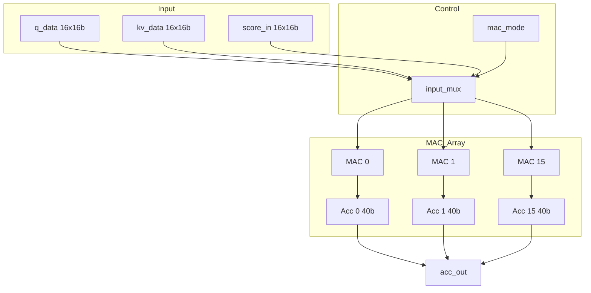

# fa_systolic 微架构规范

## 1. 模块概述

### 1.1 功能描述
16-wide 向量 MAC 阵列, 负责计算 Q*K^T (注意力分数) 和 score*V (加权输出) 两次矩阵乘法。每个 MAC 单元执行 16-bit * 16-bit -> 40-bit 乘累加操作。

### 1.2 模块类型
- 类型: `compute`
- 层级: L1 (fa_top 直接子模块)

### 1.3 设计约束
- 面积预算: ~200K gates
- 功耗预算: ~8 mW (动态)
- 时钟频率: 50 MHz
- 关键路径延迟: ~10ns (16-bit 乘法 + 40-bit 加法)

---

## 2. 接口定义

### 2.1 信号列表

| 信号名 | 方向 | 位宽 | 类型 | 描述 |
|--------|------|------|------|------|
| `clk` | input | 1 | 时钟 | 主时钟 50 MHz |
| `rst_n` | input | 1 | 控制 | 异步复位, 低有效 |
| `mac_start` | input | 1 | 控制 | 启动 MAC 计算 |
| `mac_done` | output | 1 | 控制 | MAC 计算完成 |
| `mac_mode` | input | 1 | 控制 | 0=QK_MAC, 1=SV_MAC |
| `q_data` | input | 256 (16x16) | 数据 | Q 向量 (16 个 Q8.8 元素) |
| `q_valid` | input | 1 | 控制 | Q 数据有效 |
| `kv_data` | input | 256 (16x16) | 数据 | K/V tile 数据 (16 个 Q8.8 元素) |
| `kv_valid` | input | 1 | 控制 | K/V 数据有效 |
| `score_in` | input | 256 (16x16) | 数据 | Softmax 输出 score (SV_MAC 模式) |
| `score_valid` | input | 1 | 控制 | score 数据有效 |
| `acc_out` | output | 640 (16x40) | 数据 | 累加器输出 (16 个 40-bit) |
| `acc_valid` | output | 1 | 控制 | 累加器输出有效 |
| `acc_clear` | input | 1 | 控制 | 清除累加器 |
| `elem_cnt` | input | 6 | 控制 | 当前元素计数 (0..63) |

### 2.2 接口协议

#### 2.2.1 计算启动协议
- mac_start 脉冲启动计算
- mac_mode 选择操作模式
- mac_done 在 64 cycles 后拉高 (d=64 元素)

#### 2.2.2 数据输入协议
- q_data: 每 cycle 16 个 Q 元素, 连续 4 cycles 传输 64 元素
- kv_data: 每 cycle 16 个 K/V 元素, tile 内连续传输

---

## 3. 数据通路

### 3.1 模块框图

### 3.2 流水线结构

| 级别 | 操作 | 延迟 (cycles) | 寄存器 |
|------|------|---------------|--------|
| S1 | 输入寄存 | 1 | q_reg, kv_reg |
| S2 | 乘法 (16x16->32) | 1 | mul_reg |
| S3 | 加法 (32+40->40) + 累加 | 1 | acc_reg |

### 3.3 关键路径分析
- 最大延迟路径: 乘法器 (16x16) -> 加法器 (32+40) -> 累加寄存器
- 延迟值: ~10ns
- 50 MHz 目标: 20ns 周期, 时序余量充足

---

## 4. 状态机设计

详见 [FSM.md](./FSM.md)

---

## 5. 时序规格

### 5.1 时钟域
- 主时钟域: `clk_domain`
- 时钟频率: 50 MHz

### 5.2 CDC
本模块为单时钟域, 无 CDC 问题。

### 5.3 时序约束

| 参数 | 数值 | 单位 |
|------|------|------|
| Q*K^T 延迟 | 64 | cycles |
| score*V 延迟 | 64 | cycles |
| 吞吐 | 16 | MAC/cycle |

---

## 6. 存储资源

### 6.1 寄存器定义

| 寄存器 | 位宽 | 类型 | 复位值 | 描述 |
|--------|------|------|--------|------|
| `acc[0..15]` | 40 | R/W | 0 | 累加器阵列 |
| `q_reg[0..15]` | 16 | R/W | 0 | Q 输入寄存器 |
| `kv_reg[0..15]` | 16 | R/W | 0 | K/V 输入寄存器 |

### 6.2 存储器实例
无 SRAM, 纯寄存器实现。

---

## 7. 功耗管理

### 7.1 电源域
- 所属电源域: `VDD_CORE`
- 工作电压: 0.70V

### 7.2 低功耗策略
- Clock Gating: mac_start=0 时门控 MAC 阵列时钟
- 操作数隔离: MAC 空闲时输入 AND gate 隔离

---

## 8. 验证要点

详见 [verification.md](./verification.md)

---

## 9. DFT 方案

详见 [DFT.md](./DFT.md)

---

## 10. 实现任务

详见 [tasks.md](./tasks.md)

---

## 11. 需求追踪矩阵

| REQ_ID | 需求描述 | 优先级 | 验收标准 | 边界条件 | RTL 组件 | 测试用例 |
|--------|---------|--------|---------|---------|---------|---------|
| REQ-M04-F01 | Q*K^T MAC 计算 | P1 | 与 golden 对比误差 <=0.03 | d=64 全元素 | mac_array | TC-M04-01 |
| REQ-M04-F02 | score*V MAC 计算 | P1 | 与 golden 对比误差 <=0.03 | d=64 全元素 | mac_array | TC-M04-02 |
| REQ-M04-F03 | 16-wide 并行 MAC | P1 | 每 cycle 16 MAC 操作 | 全 16 单元活跃 | mac_array | TC-M04-03 |
| REQ-M04-F04 | 40-bit 累加无溢出 | P1 | 40-bit 饱和保护 | 极端输入值 | accumulator | TC-M04-04 |
| REQ-M04-F05 | acc_clear 清除功能 | P2 | 累加器正确清零 | 计算中途清除 | accumulator | TC-M04-05 |
