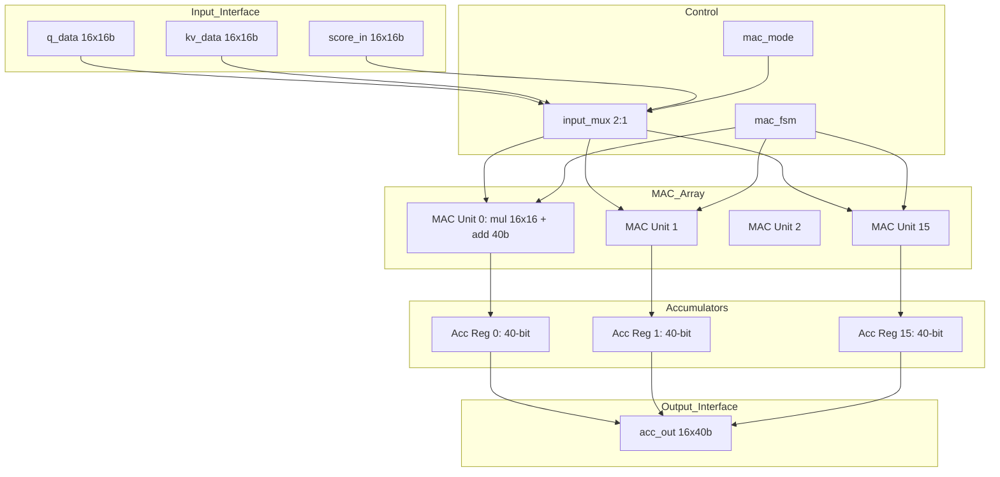
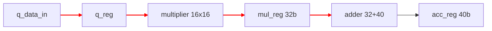

# fa_systolic 数据通路设计

## 1. 数据通路概述

### 1.1 数据流方向
- 输入: Q 向量 (16x16-bit), K/V tile (16x16-bit), score (16x16-bit)
- 处理: 16 个并行 MAC 单元, 16-bit * 16-bit -> 40-bit
- 输出: 16 个 40-bit 累加器结果

### 1.2 吞吐规格
- 输入吞吐: 16 elements/cycle
- 处理吞吐: 16 MAC/cycle
- 输出吞吐: 16 results/64 cycles

---

## 2. 模块框图

### 2.1 顶层结构 (Mermaid)



### 2.2 模块实例表

| 模块 | 实例名 | 类型 | 描述 |
|------|--------|------|------|
| `mac_unit` | `mac_array[0..15]` | compute | 16-bit MAC, 40-bit 累加 |
| `input_mux` | `input_mux` | mux | 选择 Q*K 或 score*V 输入 |
| `accumulator` | `acc_reg[0..15]` | register | 40-bit 累加器寄存器 |

---

## 3. 流水线结构

### 3.1 流水线级定义

| 级别 | 名称 | 操作 | 延迟 (cycles) | 输入寄存器 | 输出寄存器 |
|------|------|------|---------------|-----------|-----------|
| S1 | `INPUT_REG` | 输入寄存 | 1 | q_data, kv_data | q_reg, kv_reg |
| S2 | `MULTIPLY` | 16-bit 乘法 | 1 | q_reg, kv_reg | mul_reg (32-bit) |
| S3 | `ACCUMULATE` | 40-bit 加法累加 | 1 | mul_reg, acc_old | acc_reg (40-bit) |

### 3.2 流水线时序图

```
Cycle:    0    1    2    3    4   ...   63   64
S1:      Q[0] Q[1] Q[2] Q[3] Q[4] ... Q[63] --
S2:       --  Q[0] Q[1] Q[2] Q[3] ... Q[62] Q[63]
S3:       --   --  acc  acc  acc  ...  acc   acc
Output:   --   --   --   --   --  ...  --   DONE
```

### 3.3 流水线冲突处理

| 冲突类型 | 检测方式 | 处理方式 |
|----------|---------|----------|
| 数据冒险 | 无 (顺序执行) | 流水线自然串行 |
| 控制冒险 | mac_start 信号 | IDLE 状态时忽略新启动 |

---

## 4. 数据处理单元

### 4.1 计算单元

| 单元 | 功能 | 输入位宽 | 输出位宽 | 延迟 (cycles) |
|------|------|---------|---------|---------------|
| `multiplier` | 16x16 乘法 | 16+16 | 32 | 1 |
| `adder` | 32+40 加法 | 32+40 | 40 | 1 |
| `accumulator` | 40-bit 寄存累加 | 40 | 40 | 1 |

### 4.2 数据格式

| 数据 | 格式 | 位宽 | 范围 |
|------|------|------|------|
| Q, K, V 元素 | Q8.8 定点 | 16-bit | [-128, +127.996] |
| 乘法结果 | Q16.16 定点 | 32-bit | [-32768, +32767.999] |
| 累加器 | Q8.32 定点 | 40-bit | [-128, +127.999999997] |

---

## 5. 关键路径分析

### 5.1 最大延迟路径



**路径延迟分解**:
| 节点 | 延迟 (ns) | 类型 |
|------|-----------|------|
| q_reg (setup) | 0.5 | 寄存器 |
| multiplier | 5.0 | 组合逻辑 |
| adder | 4.0 | 组合逻辑 |
| acc_reg (setup) | 0.5 | 寄存器 |
| **总计** | **10.0 ns** | - |

### 5.2 时序约束
- 目标频率: 50 MHz (20ns 周期)
- 流水线深度: 3 stages
- 最大单级延迟: ~10ns (S2+S3 合并关键路径)

### 5.3 优化建议

| 优化点 | 当前延迟 (ns) | 优化后延迟 (ns) | 方法 |
|--------|--------------|----------------|------|
| multiplier | 5.0 | 4.0 | Booth 编码 |
| adder | 4.0 | 3.5 | Carry-lookahead |

---

## 6. 数据缓冲

### 6.1 FIFO 配置
无 FIFO, 纯流水线寄存器。

### 6.2 反压机制

| 反压点 | 触发条件 | 反压信号 | 效果 |
|--------|---------|----------|------|
| 输入端 | MAC_RUN 时 | busy | 上游暂停发送 |

---

## 7. 控制信号

### 7.1 数据通路控制

| 控制信号 | 来源 | 作用 | 时序 |
|----------|------|------|------|
| `mac_start` | fa_ctrl | 启动 MAC 计算 | 脉冲 |
| `mac_mode` | fa_ctrl | 选择输入源 (Q*K 或 score*V) | 电平 |
| `acc_clear` | fa_ctrl | 清除累加器 | 脉冲 |
| `elem_cnt` | 内部计数器 | 跟踪元素位置 | 递增 |

### 7.2 控制字格式

| 位域 | 名称 | 值 | 描述 |
|------|------|---|------|
| `[0]` | `mac_mode` | 0/1 | 0=QK_MAC, 1=SV_MAC |
| `[1]` | `acc_clear` | 0/1 | 1=清除累加器 |
