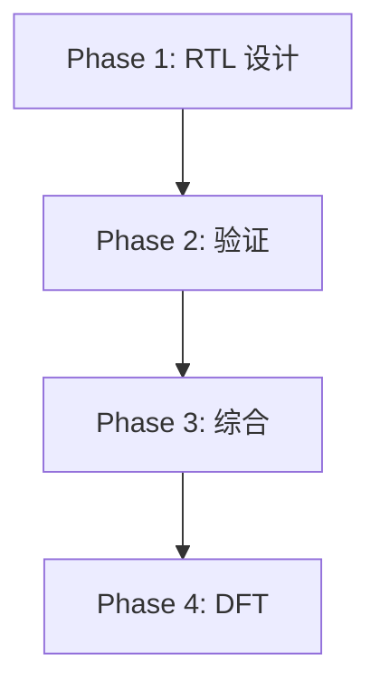

# fa_systolic 实现任务列表

## 1. 任务概述

### 1.1 实现阶段
- 总阶段数: 4
- 总任务数: 12
- 预估工作量: 32 hours

### 1.2 任务依赖关系

---

## Phase 1: RTL 设计 (16 hours)

### 1.1 MAC 单元设计
- [ ] 实现 16x16 乘法器 (Booth 编码)
  - 参考: datapath.md S2
  - Token 预算: 2000
  - Agent 风险: 低
- [ ] 实现 40-bit 加法器 (Carry-lookahead)
  - 参考: datapath.md S3
  - Token 预算: 1500
  - Agent 风险: 低

### 1.2 MAC 阵列
- [ ] 实现 16-wide MAC 阵列
  - 参考: datapath.md, MAS.md
  - Token 预算: 3000
  - Agent 风险: 中
- [ ] 实现累加器阵列 (16x40-bit)
  - 参考: datapath.md
  - Token 预算: 2000
  - Agent 风险: 低

### 1.3 控制逻辑
- [ ] 实现 mac_fsm (三段式)
  - 参考: FSM.md
  - Token 预算: 2000
  - Agent 风险: 低
- [ ] 实现输入多路选择器
  - 参考: datapath.md
  - Token 预算: 1000
  - Agent 风险: 低

### 1.4 饱和保护
- [ ] 实现 40-bit 饱和逻辑
  - 参考: MAS.md
  - Token 预算: 1500
  - Agent 风险: 低

---

## Phase 2: 功能验证 (10 hours)

### 2.1 测试平台
- [ ] 创建 cocotb Driver
- [ ] 创建 cocotb Monitor
- [ ] 创建 NumPy Golden Model

### 2.2 测试用例
- [ ] TC-001: QK 基本计算
- [ ] TC-002: SV 基本计算
- [ ] TC-003: 最大值边界
- [ ] TC-004: 最小值边界
- [ ] TC-005: 中途清除

---

## Phase 3: 综合 (4 hours)

### 3.1 综合执行
- [ ] Yosys 综合
- [ ] 时序分析 (OpenSTA)
- [ ] 面积报告

---

## Phase 4: DFT (2 hours)

### 4.1 扫描链插入
- [ ] 配置 chain_4, chain_5
- [ ] ATPG 向量生成
- [ ] 覆盖率验证

---

## 任务统计

| 阶段 | 任务数 | 已完成 | 进度 |
|------|--------|--------|------|
| Phase 1 | 7 | 0 | 0% |
| Phase 2 | 5 | 0 | 0% |
| Phase 3 | 3 | 0 | 0% |
| Phase 4 | 3 | 0 | 0% |
