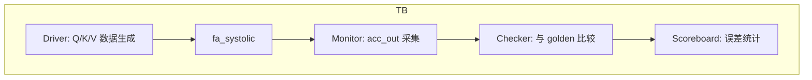

# fa_systolic 验证计划

## 1. 验证概述

### 1.1 验证目标
- 功能覆盖率目标: 100%
- 代码覆盖率目标: 100% line, 100% branch
- 断言覆盖率目标: 100%

### 1.2 验证方法
- 仿真验证: cocotb + Verilator
- Golden Model: NumPy FP32 参考实现

---

## 2. 功能覆盖点

### 2.1 功能覆盖矩阵

| 覆盖点 ID | 功能 | 类型 | 优先级 | 覆盖方式 |
|-----------|------|------|--------|----------|
| `FC-001` | QK_MAC 模式基本功能 | 功能 | P1 | 仿真 |
| `FC-002` | SV_MAC 模式基本功能 | 功能 | P1 | 仿真 |
| `FC-003` | 16-wide 并行 MAC | 功能 | P1 | 仿真 |
| `FC-004` | 40-bit 累加饱和 | 边界 | P1 | 仿真 |
| `FC-005` | acc_clear 功能 | 功能 | P2 | 仿真 |
| `FC-006` | 全零输入 | 边界 | P2 | 仿真 |
| `FC-007` | 极值输入 | 边界 | P1 | 仿真 |

---

## 3. 断言定义

### 3.1 断言列表

| 断言 ID | 类型 | 严重性 | 描述 |
|----------|------|--------|------|
| `A-001` | Concurrent | Error | mac_done 只在 MAC_DONE 状态为高 |
| `A-002` | Concurrent | Error | busy 在 MAC_RUN 状态为高 |
| `A-003` | Concurrent | Warning | mac_start 在 MAC_RUN 时被忽略 |
| `A-004` | Concurrent | Error | elem_cnt 在 MAC_RUN 时递增 |

---

## 4. 仿真场景

### 4.1 正常场景

| 场景 ID | 名称 | 描述 | 输入 | 预期输出 |
|----------|------|------|------|----------|
| `N-001` | QK 基本计算 | Q*K^T 矩阵乘法 | 随机 Q[64], K[16][64] | 与 golden 一致 |
| `N-002` | SV 基本计算 | score*V 矩阵乘法 | 随机 score[16], V[16][64] | 与 golden 一致 |
| `N-003` | 全 1 输入 | 验证基本乘累加 | 全 1.0 (Q8.8=0x0100) | sum=64.0 |

### 4.2 边界场景

| 场景 ID | 名称 | 边界条件 | 预期行为 |
|----------|------|----------|----------|
| `B-001` | 最大值输入 | 全 127.996 (Q8.8 max) | 饱和保护, 不溢出 |
| `B-002` | 最小值输入 | 全 -128.0 (Q8.8 min) | 饱和保护, 不溢出 |
| `B-003` | 交替极值 | +max/-max 交替 | 累加器正确 |

### 4.3 异常场景

| 场景 ID | 名称 | 异常类型 | 处理方式 |
|----------|------|----------|----------|
| `E-001` | 计算中重启 | mac_start 冲突 | 当前计算完成后回到 IDLE |
| `E-002` | 中途清除 | acc_clear 脉冲 | 累加器清零, 重新开始 |

---

## 5. 测试用例

### 5.1 测试用例列表

| 用例 ID | 类型 | 场景 | 覆盖点 | 状态 |
|----------|------|------|--------|------|
| `TC-001` | 功能 | N-001 | FC-001 | 待实现 |
| `TC-002` | 功能 | N-002 | FC-002 | 待实现 |
| `TC-003` | 边界 | B-001 | FC-004 | 待实现 |
| `TC-004` | 边界 | B-002 | FC-004 | 待实现 |
| `TC-005` | 异常 | E-001 | FC-005 | 待实现 |

---

## 6. 测试平台架构

### 6.1 测试平台框图

### 6.2 测试组件

| 组件 | 功能 | 实现方式 |
|------|------|----------|
| Driver | 生成 Q/K/V 测试数据 | cocotb coroutine |
| Monitor | 采集 acc_out 结果 | cocotb coroutine |
| Checker | 与 NumPy golden 比较 | Python assert |

---

## 7. 时序验证

### 7.1 Cycle 延迟检查点

| 检查点 | 预期延迟 | 允许偏差 | 方法 |
|--------|---------|---------|------|
| mac_start -> mac_done | 65 cycles | +-1 cycle | 仿真计数 |

### 7.2 精度指标

| 指标 | 目标 | 说明 |
|------|------|------|
| mean_abs_error | <= 0.03 | 平均绝对误差 vs golden |
| max_abs_error | <= 0.10 | 最大绝对误差 |
