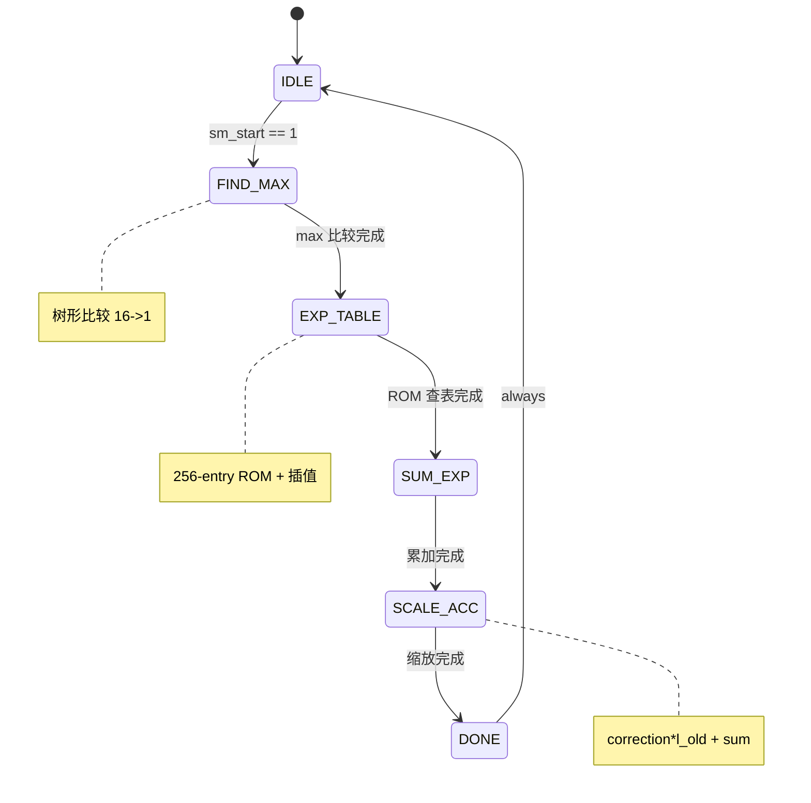

# fa_softmax 状态机设计

## 1. FSM 概述

### 1.1 状态机列表

| FSM 名称 | 类型 | 状态数 | 描述 |
|----------|------|--------|------|
| `softmax_fsm` | Moore | 6 | Softmax 更新控制 |

---

## 2. softmax_fsm 详细设计

### 2.1 状态定义

| 状态名 | 编码 (二进制) | 编码 (十六进制) | 描述 |
|--------|--------------|----------------|------|
| `IDLE` | `000` | `0x0` | 空闲 |
| `FIND_MAX` | `001` | `0x1` | 比较 16 个 score 找最大值 |
| `EXP_TABLE` | `010` | `0x2` | ROM 查表计算 exp |
| `SUM_EXP` | `011` | `0x3` | 累加 exp 值 |
| `SCALE_ACC` | `100` | `0x4` | 缩放旧累加器 + 更新 m/l |
| `DONE` | `101` | `0x5` | 完成, 输出结果 |

### 2.2 状态编码策略
- 编码方式: `binary`
- 选择理由: 6 状态, binary 编码面积最小

### 2.3 状态转移表

| # | 当前状态 | 转移条件 | 目标状态 | 输出变化 | 延迟 |
|---|----------|---------|----------|----------|------|
| 1 | `IDLE` | `sm_start == 1` | `FIND_MAX` | `busy = 1` | 1 |
| 2 | `FIND_MAX` | `always` | `EXP_TABLE` | `max_done = 1` | 1 |
| 3 | `EXP_TABLE` | `always` | `SUM_EXP` | `exp_done = 1` | 1 |
| 4 | `SUM_EXP` | `always` | `SCALE_ACC` | `sum_done = 1` | 1 |
| 5 | `SCALE_ACC` | `always` | `DONE` | `scale_done = 1` | 1 |
| 6 | `DONE` | `always` | `IDLE` | `sm_done = 1` | 1 |

### 2.4 输出函数

| 状态 | 输出信号 | 输出值 | Moore/Mealy |
|------|----------|--------|-------------|
| `IDLE` | `busy` | 0 | Moore |
| `FIND_MAX` | `max_en` | 1 | Moore |
| `EXP_TABLE` | `lut_en` | 1 | Moore |
| `SUM_EXP` | `sum_en` | 1 | Moore |
| `SCALE_ACC` | `scale_en` | 1 | Moore |
| `DONE` | `sm_done` | 1 | Moore |

---

## 3. 状态图 (Mermaid)



---

## 4. 转移条件详细定义

### 4.1 条件表达式

| 条件名 | 表达式 | 描述 |
|--------|--------|------|
| `start_cond` | `sm_start && state==IDLE` | 启动条件 |
| `max_done` | `max_tree_valid` | 比较器输出有效 |
| `exp_done` | `lut_out_valid` | ROM 输出有效 |
| `sum_done` | `sum_acc_done` | 累加完成 |
| `scale_done` | `scale_out_valid` | 缩放输出有效 |

---

## 5. 异常处理

### 5.1 异常状态

| 异常 | 触发条件 | 处理方式 |
|------|---------|----------|
| score 全为 -inf | causal mask 全遮挡 | m_new=-inf, l_new=0, exp_out=0 |

### 5.2 复位处理
- 复位类型: 异步置位同步释放
- 复位后状态: IDLE
- m_reg 复位为 -inf (Q8.8: 0x8000)

---

## 6. 时序规格

### 6.1 状态保持时间

| 状态 | 最小保持 | 最大保持 | 条件 |
|------|---------|----------|------|
| 每个状态 | 1 cycle | 1 cycle | 固定流水 |

### 6.2 关键路径延迟
- 状态转移延迟: 1 cycle
- 总延迟: 5 cycles (含 IDLE->DONE)

---

## 7. RTL 实现建议

### 7.1 推荐实现结构

```systemverilog
// 三段式 FSM
always_ff @(posedge clk or negedge rst_n) begin
    if (!rst_n) state <= IDLE;
    else state <= next_state;
end

always_comb begin
    case (state)
        IDLE:      next_state = sm_start ? FIND_MAX : IDLE;
        FIND_MAX:  next_state = EXP_TABLE;
        EXP_TABLE: next_state = SUM_EXP;
        SUM_EXP:   next_state = SCALE_ACC;
        SCALE_ACC: next_state = DONE;
        DONE:      next_state = IDLE;
        default:   next_state = IDLE;
    endcase
end
```

---

## 8. 验证要点

### 8.1 状态覆盖

| 状态 | 覆盖要求 | 测试方法 |
|------|---------|----------|
| IDLE | 必须覆盖 | 复位后 |
| FIND_MAX..DONE | 必须覆盖 | 完整 softmax 流程 |

### 8.2 转移覆盖

| 转移路径 | 覆盖要求 | 测试场景 |
|----------|---------|----------|
| IDLE->FIND_MAX->...->IDLE | 必须覆盖 | 单 tile softmax |
