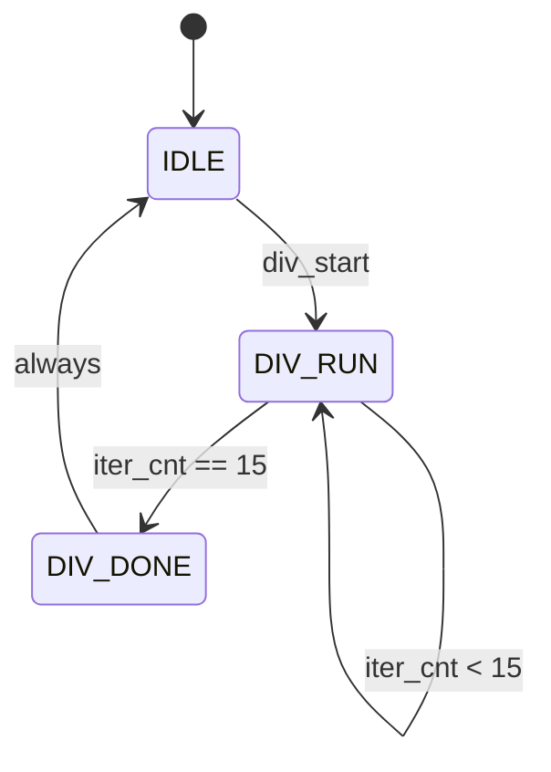

# fa_divider 状态机设计

## 1. FSM 概述

| FSM 名称 | 类型 | 状态数 | 描述 |
|----------|------|--------|------|
| `div_fsm` | Moore | 3 | 除法器控制, 固定 16 次迭代 |

## 2. div_fsm 详细设计

### 2.1 状态定义

| 状态名 | 编码 | 描述 |
|--------|------|------|
| `IDLE` | `00` | 空闲 |
| `DIV_RUN` | `01` | 迭代中 (16 cycles) |
| `DIV_DONE` | `10` | 完成 |

### 2.2 状态转移表

| # | 当前状态 | 转移条件 | 目标状态 | 输出 |
|---|----------|---------|----------|------|
| 1 | `IDLE` | `div_start` | `DIV_RUN` | `busy=1, iter_cnt=0` |
| 2 | `DIV_RUN` | `iter_cnt==15` | `DIV_DONE` | `div_done=1` |
| 3 | `DIV_RUN` | `iter_cnt<15` | `DIV_RUN` | `iter_cnt++, subtract` |
| 4 | `DIV_DONE` | `always` | `IDLE` | `busy=0` |

## 3. 状态图 (Mermaid)



## 4. 异常处理

| 异常 | 触发条件 | 处理 |
|------|---------|------|
| divisor=0 | 除数为零 | quotient=0, div_done 立即拉高 |

## 5. RTL 实现建议

```systemverilog
always_ff @(posedge clk or negedge rst_n) begin
    if (!rst_n) begin
        state <= IDLE;
        iter_cnt <= 4'd0;
    end else case (state)
        IDLE: if (div_start) begin
            state <= DIV_RUN;
            iter_cnt <= 4'd0;
            remainder_reg <= dividend;
            divisor_reg <= divisor;
        end
        DIV_RUN: begin
            iter_cnt <= iter_cnt + 1;
            if (iter_cnt == 4'd15)
                state <= DIV_DONE;
        end
        DIV_DONE: state <= IDLE;
    endcase
end
```
