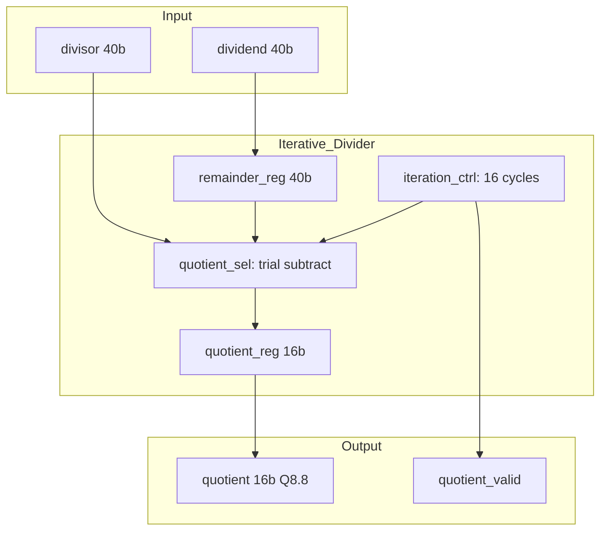

# fa_divider 微架构规范

## 1. 模块概述

### 1.1 功能描述
迭代 SRT 除法器, 固定 16 次迭代, 计算 O[i][j] = acc[j] / l。64 个元素共享一个除法器, 每行计算结束时执行。

### 1.2 模块类型
- 类型: `compute`
- 层级: L1

### 1.3 设计约束
- 面积预算: ~10K gates
- 功耗预算: ~1 mW
- 时钟频率: 50 MHz
- 关键路径延迟: ~15ns (单次迭代)

---

## 2. 接口定义

### 2.1 信号列表

| 信号名 | 方向 | 位宽 | 类型 | 描述 |
|--------|------|------|------|------|
| `clk` | input | 1 | 时钟 | 50 MHz |
| `rst_n` | input | 1 | 控制 | 异步复位, 低有效 |
| `div_start` | input | 1 | 控制 | 启动除法 |
| `div_done` | output | 1 | 控制 | 除法完成 |
| `dividend` | input | 40 | 数据 | 被除数 (acc[j]) |
| `divisor` | input | 40 | 数据 | 除数 (l) |
| `quotient` | output | 16 | 数据 | 商 (Q8.8) |
| `quotient_valid` | output | 1 | 控制 | 商有效 |
| `busy` | output | 1 | 控制 | 除法器忙 |

---

## 3. 数据通路

### 3.1 模块框图

### 3.2 流水线结构

| 级别 | 操作 | 延迟 (cycles) |
|------|------|---------------|
| Iter 0..15 | trial subtract + shift | 16 (固定) |

### 3.3 关键路径分析
- 最大延迟路径: remainder_reg -> subtractor -> mux -> remainder_reg
- 延迟值: ~15ns
- 50 MHz 目标: 20ns 周期, 时序余量 5ns

---

## 4. 状态机设计

详见 [FSM.md](./FSM.md)

---

## 5. 时序规格

| 参数 | 数值 | 单位 |
|------|------|------|
| 单次除法延迟 | 16 | cycles |
| 64 元素总延迟 | 1024 | cycles |

---

## 6. 存储资源

| 寄存器 | 位宽 | 类型 | 描述 |
|--------|------|------|------|
| `remainder_reg` | 40 | R/W | 余数寄存器 |
| `quotient_reg` | 16 | R/W | 商寄存器 |
| `divisor_reg` | 40 | R/W | 除数寄存器 |
| `iter_cnt` | 4 | R/W | 迭代计数器 |

---

## 7. 功耗管理
- Clock Gating: div_start=0 时门控

---

## 8. 验证要点

详见 [verification.md](./verification.md)

---

## 9. DFT 方案

详见 [DFT.md](./DFT.md)

---

## 10. 实现任务

详见 [tasks.md](./tasks.md)

---

## 11. 需求追踪矩阵

| REQ_ID | 需求描述 | 优先级 | 验收标准 | 边界条件 | RTL 组件 | 测试用例 |
|--------|---------|--------|---------|---------|---------|---------|
| REQ-M06-F01 | 固定 16 次迭代除法 | P1 | 商精度误差 <=1 LSB | 被除数=0 时输出 0 | iteration_ctrl | TC-M06-01 |
| REQ-M06-F02 | 40-bit / 40-bit -> 16-bit | P1 | Q8.8 格式输出 | 除数=0 检测 | quotient_sel | TC-M06-02 |
| REQ-M06-F03 | div_done 脉冲 | P1 | 16 cycles 后拉高 | 连续启动 | iteration_ctrl | TC-M06-03 |
