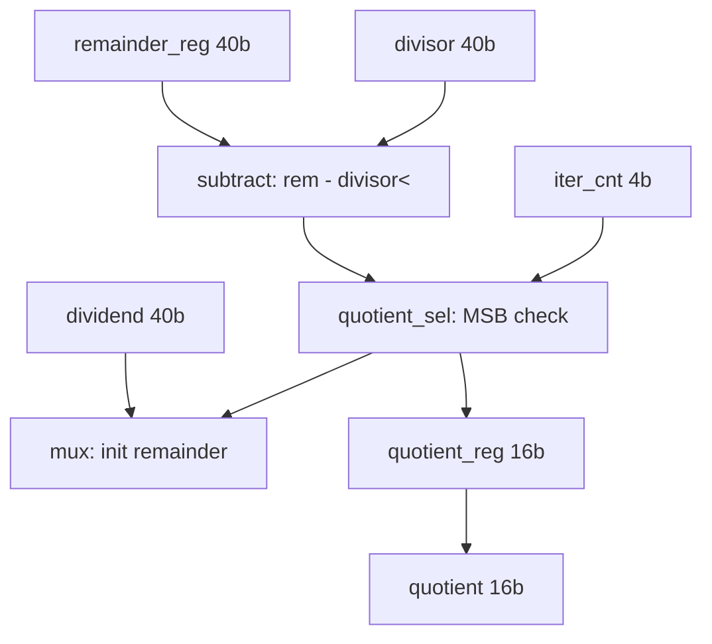

# fa_divider 数据通路设计

## 1. 概述

- 输入: dividend (40-bit), divisor (40-bit)
- 处理: SRT 迭代除法, 16 次 trial subtract + shift
- 输出: quotient (16-bit Q8.8)

## 2. 模块框图



## 3. 数据处理

| 单元 | 功能 | 输入位宽 | 输出位宽 | 延迟 |
|------|------|---------|---------|------|
| subtractor | trial subtract | 40+40 | 41 | 1 cycle |
| quotient_sel | MSB 判断 + 移位 | 41 | 16 | 1 cycle |

## 4. SRT 迭代算法

```
remainder = dividend
quotient = 0
for i in 15..0:
    trial = remainder - (divisor << i)
    if trial >= 0:
        remainder = trial
        quotient[i] = 1
    else:
        quotient[i] = 0
```

## 5. 关键路径

| 节点 | 延迟 (ns) |
|------|-----------|
| remainder_reg -> subtractor | 8.0 |
| subtractor -> mux | 5.0 |
| mux -> remainder_reg | 2.0 |
| **总计** | **15.0 ns** |

## 6. 数据格式

| 数据 | 格式 | 位宽 |
|------|------|------|
| dividend | Q8.32 | 40-bit |
| divisor | Q8.32 | 40-bit |
| quotient | Q8.8 | 16-bit |
