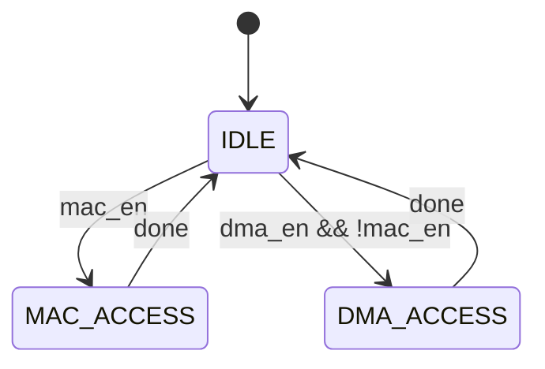

# fa_buffer_mgr 状态机设计

## 1. FSM 概述

| FSM 名称 | 类型 | 状态数 | 描述 |
|----------|------|--------|------|
| `buf_arb_fsm` | Moore | 3 | 访问仲裁控制 |

## 2. buf_arb_fsm 详细设计

### 2.1 状态定义

| 状态名 | 编码 | 描述 |
|--------|------|------|
| `IDLE` | `00` | 无访问 |
| `MAC_ACCESS` | `01` | MAC 读访问中 |
| `DMA_ACCESS` | `10` | DMA 读写访问中 |

### 2.2 状态转移表

| # | 当前状态 | 转移条件 | 目标状态 | 输出 |
|---|----------|---------|----------|------|
| 1 | `IDLE` | `mac_*_en` | `MAC_ACCESS` | mac_grant=1 |
| 2 | `IDLE` | `dma_*_en && !mac_*_en` | `DMA_ACCESS` | dma_grant=1 |
| 3 | `MAC_ACCESS` | `always` | `IDLE` | 完成 |
| 4 | `DMA_ACCESS` | `always` | `IDLE` | 完成 |

### 2.3 仲裁优先级
1. MAC 读 (最高) - 计算流水线不能停
2. DMA 写 (高) - 数据输入
3. Softmax 读 (中)
4. Divider 读 (低)

## 3. 状态图



## 4. 双缓冲控制

### 4.1 buf_sel 逻辑
- buf_sel=0: MAC 读 buf_a, DMA 写 buf_b
- buf_sel=1: MAC 读 buf_b, DMA 写 buf_a
- tile 切换时翻转 buf_sel

### 4.2 切换时序
```
tile N 计算中: buf_sel=0, MAC 读 buf_a, DMA 写 buf_b
tile N 完成:   buf_sel 切换到 1
tile N+1:      MAC 读 buf_b, DMA 写 buf_a
```
