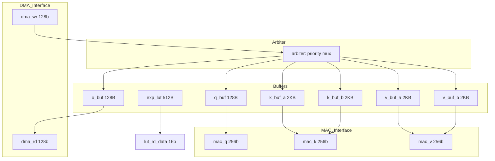

# fa_buffer_mgr 数据通路设计

## 1. 概述
管理 5 个 SRAM buffer 的读写数据通路, 实现仲裁和双缓冲切换。

## 2. 模块框图



## 3. 存储器实例

| 名称 | 类型 | 深度 | 宽度 | 端口 |
|------|------|------|------|------|
| q_buf | SRAM | 64 | 16 | 1RW |
| k_buf_a | SRAM | 1024 | 16 | 1RW |
| k_buf_b | SRAM | 1024 | 16 | 1RW |
| v_buf_a | SRAM | 1024 | 16 | 1RW |
| v_buf_b | SRAM | 1024 | 16 | 1RW |
| o_buf | SRAM | 64 | 16 | 1RW |
| exp_lut | ROM | 256 | 16 | 1R |

## 4. 数据格式

| 数据 | 位宽 | 说明 |
|------|------|------|
| DMA 数据 | 128-bit | 8 个 Q8.8 元素 |
| MAC 数据 | 256-bit | 16 个 Q8.8 元素 |
| SRAM 单元 | 16-bit | 1 个 Q8.8 元素 |

## 5. 仲裁逻辑

```systemverilog
// 优先级仲裁
always_comb begin
    if (mac_k_en || mac_v_en || mac_q_en) begin
        grant = MAC;
    end else if (dma_wr_en || dma_rd_en) begin
        grant = DMA;
    end else if (sm_lut_en) begin
        grant = LUT;
    end else begin
        grant = NONE;
    end
end
```
