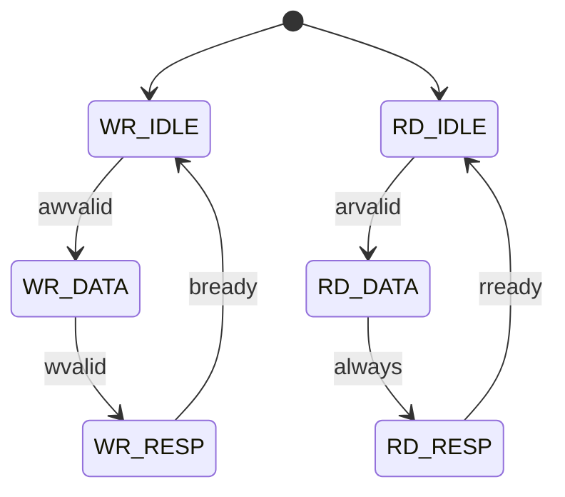

# fa_regfile 状态机设计

## 1. FSM 概述

| FSM 名称 | 类型 | 状态数 | 描述 |
|----------|------|--------|------|
| `axil_wr_fsm` | Moore | 3 | AXI4-Lite 写通道 |
| `axil_rd_fsm` | Moore | 3 | AXI4-Lite 读通道 |

## 2. axil_wr_fsm

### 2.1 状态定义

| 状态名 | 编码 | 描述 |
|--------|------|------|
| `WR_IDLE` | `00` | 等待写地址 |
| `WR_DATA` | `01` | 等待写数据 |
| `WR_RESP` | `10` | 发送写响应 |

### 2.2 状态转移表

| # | 当前 | 条件 | 目标 | 输出 |
|---|------|------|------|------|
| 1 | `WR_IDLE` | `awvalid` | `WR_DATA` | 锁存 awaddr |
| 2 | `WR_DATA` | `wvalid` | `WR_RESP` | 写入寄存器, bvalid=1 |
| 3 | `WR_RESP` | `bready` | `WR_IDLE` | bvalid=0 |

## 3. axil_rd_fsm

### 3.1 状态定义

| 状态名 | 编码 | 描述 |
|--------|------|------|
| `RD_IDLE` | `00` | 等待读地址 |
| `RD_DATA` | `01` | 准备读数据 |
| `RD_RESP` | `10` | 发送读响应 |

### 3.2 状态转移表

| # | 当前 | 条件 | 目标 | 输出 |
|---|------|------|------|------|
| 1 | `RD_IDLE` | `arvalid` | `RD_DATA` | 锁存 araddr |
| 2 | `RD_DATA` | `always` | `RD_RESP` | rvalid=1, rdata=寄存器值 |
| 3 | `RD_RESP` | `rready` | `RD_IDLE` | rvalid=0 |

## 4. 状态图



## 5. W1C 逻辑

```systemverilog
// Write-1-to-Clear for STATUS register
always_ff @(posedge clk or negedge rst_n) begin
    if (!rst_n)
        status_reg <= 32'd0;
    else if (wr_en && addr == 6'h04)
        status_reg <= status_reg & ~wdata;  // W1C
    else
        status_reg <= hw_status_in;  // 硬件更新
end
```

## 6. 写保护逻辑

```systemverilog
// 写保护: BUSY 时忽略除 STATUS 外的写
wire wr_protect = status_reg[0] && (addr != 6'h04);
wire actual_wr_en = wr_en && !wr_protect;
```
