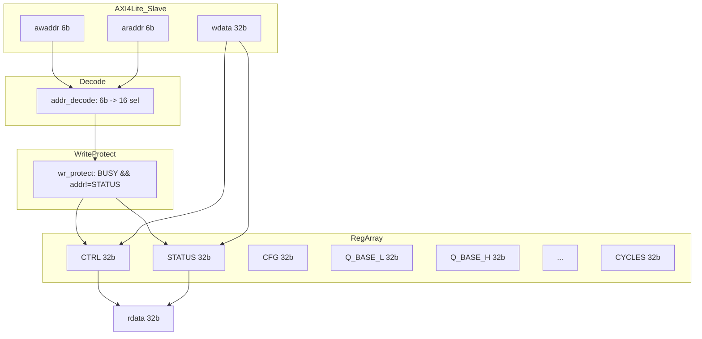

# fa_regfile 数据通路设计

## 1. 概述
AXI4-Lite 从接口到 16 个 32-bit 寄存器的数据通路。

## 2. 模块框图

## 3. 数据处理

| 操作 | 路径 | 延迟 |
|------|------|------|
| 写 | awaddr -> decode -> reg_write | 2 cycles |
| 读 | araddr -> decode -> reg_read -> rdata | 2 cycles |

## 4. W1C 处理

| 寄存器 | W1C 位 | 说明 |
|--------|--------|------|
| STATUS[1] | DONE | 写 1 清零 |
| STATUS[2] | ERROR | 写 1 清零 |

## 5. Self-clearing 位

| 寄存器 | 位 | 说明 |
|--------|-----|------|
| CTRL[0] | START | 写 1 后硬件自动清零 |
| CTRL[1] | SOFT_RESET | 写 1 后硬件自动清零 |
