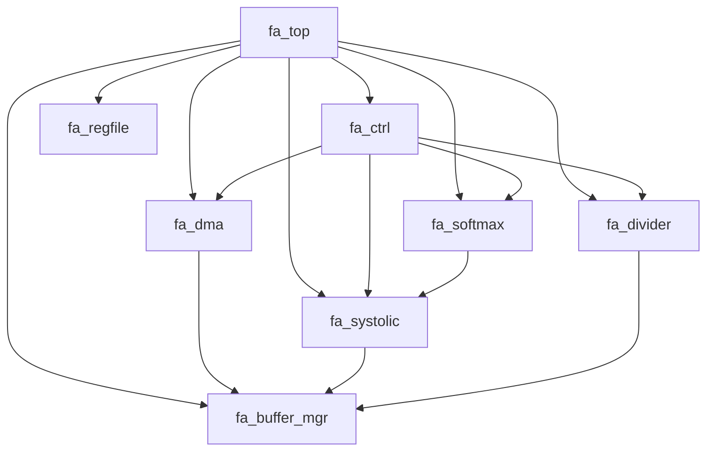

# FlashAttention 加速器 — 模块树

## 模块层次结构

```
fa_top (M01) — 顶层封装
├── fa_ctrl (M02) — 主控制器 FSM
├── fa_dma (M03) — AXI4 Master DMA 引擎
├── fa_systolic (M04) — MAC 阵列 16-wide
├── fa_softmax (M05) — 在线 Softmax 单元
├── fa_divider (M06) — 迭代除法器
├── fa_buffer_mgr (M07) — 片上 Buffer 管理器
└── fa_regfile (M08) — AXI4-Lite 从接口 + 寄存器文件
```

## 模块分类

| 编号 | 模块名 | 类型 | 功能简述 |
|------|--------|------|----------|
| M01 | fa_top | io | 顶层封装, 子模块例化, 接口聚合 |
| M02 | fa_ctrl | compute | 主控制器 FSM, 管理计算流程 |
| M03 | fa_dma | io | AXI4 Master DMA, Q/K/V/O 数据搬运 |
| M04 | fa_systolic | compute | 16-wide MAC 阵列, Q*K^T 和 score*V |
| M05 | fa_softmax | compute | 在线 softmax: max + exp LUT + 累加 |
| M06 | fa_divider | compute | 迭代 SRT 除法器, 固定 16 cycles |
| M07 | fa_buffer_mgr | storage | 片上 SRAM buffer 管理, 仲裁 |
| M08 | fa_regfile | io | AXI4-Lite 从接口, 寄存器文件 |

## 模块依赖关系


