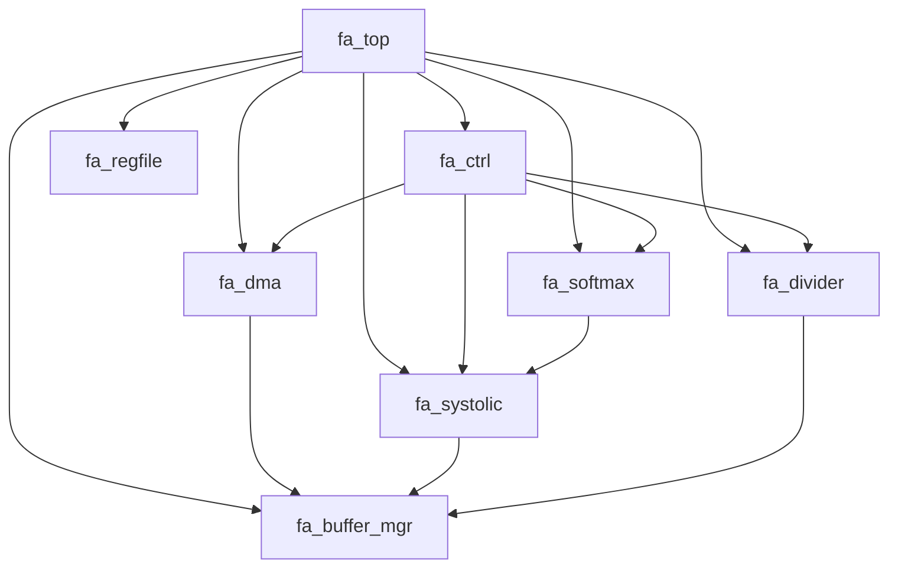

# FlashAttention 加速器 — 实现计划

## 1. 模块依赖关系



## 2. 实现阶段

### Phase 1: 叶子模块 (无依赖, 可并行)

| 模块 | 工作量 | 依赖 |
|------|--------|------|
| M04 fa_systolic | 32h | 无 |
| M05 fa_softmax | 24h | 无 |
| M06 fa_divider | 16h | 无 |
| M07 fa_buffer_mgr | 16h | 无 |
| M08 fa_regfile | 16h | 无 |

### Phase 2: 控制模块 (依赖叶子)

| 模块 | 工作量 | 依赖 |
|------|--------|------|
| M02 fa_ctrl | 24h | M03, M04, M05, M06 |
| M03 fa_dma | 24h | M07 |

### Phase 3: 集成

| 模块 | 工作量 | 依赖 |
|------|--------|------|
| M01 fa_top | 8h | 全部 |

## 3. 并行实现矩阵

```
Week 1: M04, M05, M06, M07, M08 (并行)
Week 2: M02, M03 (并行)
Week 3: M01 + 集成验证
```

## 4. 验证里程碑

| 里程碑 | 标准 | 时间 |
|--------|------|------|
| Unit Pass | 所有模块单元测试通过 | Week 2 |
| Integration Pass | 模块间交互正确 | Week 3 |
| System Pass | 端到端计算正确 | Week 3 |
| Gate Pass | 覆盖率达标, 性能达标 | Week 3 |
